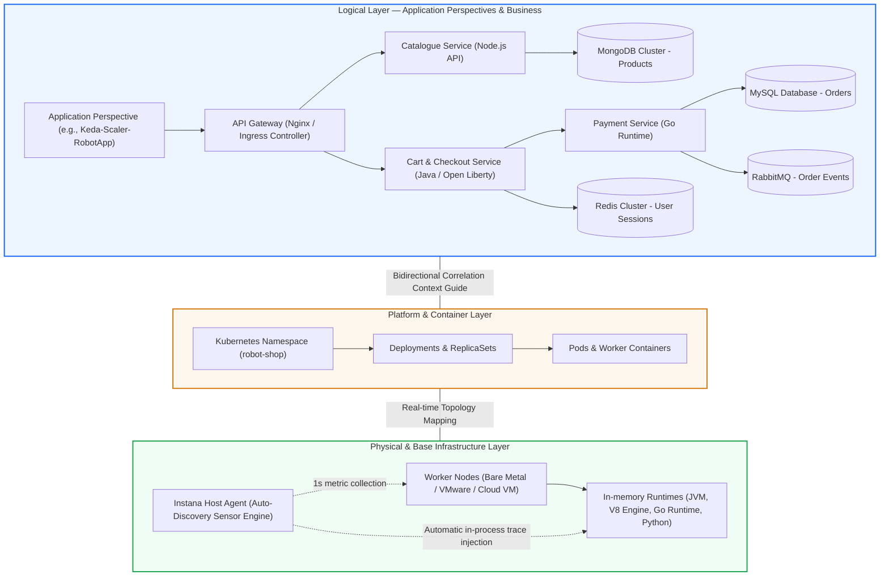

# **Observability and APM Workshop with IBM Instana**

---

## **Welcome to the Ultimate IBM Instana Hands-on Lab**

Welcome to the most complete and in-depth workshop on **IBM Instana Observability**. This hands-on, interactive guide is designed to transform you into an expert in Application Performance Monitoring (**APM**), distributed systems analysis, cloud-native infrastructure diagnostics, and AI-driven incident response automation.

Through the real **IBM Dev Sandbox** environment, you will explore how Instana solves major challenges in Site Reliability Engineering (**SRE**) and DevOps: zero-code automated instrumentation, infrastructure metric collection at **1-second resolution**, **100% trace capture without sampling (*No-Sampling*)**, and incident resolution powered by the **Dynamic Graph** and **Root Cause Analysis (RCA)** engine.

???+ info "Access to the Sandbox Environment"
    To perform the practical exercises in this workshop, we will use the shared cloud environment:
    
    * **Access URL:** [`https://ibmdevsandbox-instanaibm.instana.io/#/home`](https://ibmdevsandbox-instanaibm.instana.io/#/home)
    * **Working Mode:** Guided analysis and auditing across real production clusters and active polyglot microservice applications (*Stan's Robot Shop*, *Quote of the Day*, *OTel Demo*, payment gateways, databases, and Kafka/RabbitMQ queues). No prior deployment or local agent installation is required.

---

## **Workshop Structure and Full Agenda**

The workshop is structured into 8 specialized modules with progressive technical depth:

| Module | Title | Technical Focus and Learning Objectives | ⏱ Duration |
| :--- | :--- | :--- | :--- |
| [**Lab 0**](lab0/index.md) | **Environment, Console, and Dynamic Focus** | Instana architecture, console navigation, *Time Picker* controls (*Live*, historical, and *Time-Shift*), and universal search with *Dynamic Focus*. | 15 min |
| [**Lab 1**](lab1/index.md) | **Infrastructure 3D, 1s Metrics & JVMs** | Real-time 3D topology, perspective switching, 1-second telemetry to capture micro-bursts, *Stack* navigation, and in-depth *JVM* diagnostics. | 20 min |
| [**Lab 2**](lab2/index.md) | **Application Perspectives & Service Flow** | Semantic application definitions, dynamic dependency graphs (*Service Flow*), *Golden Signals (RED)* monitoring, and endpoint performance. | 20 min |
| [**Lab 3**](lab3/index.md) | **100% Tracing No-Sampling & Analytics** | Full distributed tracing without probabilistic sampling, *Waterfall* view, SQL/NoSQL query payload inspection, and massive queries in *Unbounded Analytics*. | 20 min |
| [**Lab 4**](lab4/index.md) | **Incidents, RCA & Change Events** | Eliminating alert storms (*Alert Storms*), AI correlation engine, root cause tree (*Root Cause Tree*), and correlation with *Change Events* (Git/Rollouts). | 15 min |
| [**Lab 5**](lab5/index.md) | **SmartAlerts, SLOs & Custom Dashboards** | Setting up Machine Learning-powered *SmartAlerts*, managing *Service Level Objectives (SLOs)*, *Error Budgets*, *Burn Rate* calculations, and dashboards. | 15 min |
| [**Lab 6**](lab6/index.md) | **Kubernetes & OpenShift Observability** | End-to-end K8s/OCP cluster observability, mapping Namespaces, Deployments, Pods, Services, quota saturation, CPU Throttling, and Kube-State events. | 15 min |
| [**Lab 7**](lab7/index.md) | **OpenTelemetry, SDK & Action Automation** | Ingesting OTel traces and metrics (OTLP), custom spans with Java/Node SDK, W3C TraceContext, and executing automated runbooks (*Action Framework*). | 15 min |

---

## **Dynamic Graph Architecture: The Backbone of Instana**

Unlike traditional platforms that store metrics, logs, and traces in disconnected silos, Instana builds its architecture on the **Dynamic Graph**: an in-memory, topological, and temporal data model that continuously updates dependencies between physical hardware, virtualization, containers, and logical services second by second:

---

## **The 5 Key Differentiators of IBM Instana**

-   :material-magnify-scan:{ .lg .middle } **1. Auto-Discovery (Zero-Code)**

    ---

    - Dynamic sensor injection without restarting applications.
    - Automatic detection of over 300 technologies.
    - Continuous real-time dependency mapping.

-   :material-timer-outline:{ .lg .middle } **2. 1-Second Granularity**

    ---

    - No 1-to-5 minute averages or rollups.
    - Precise detection of CPU and memory micro-bursts.
    - Accurate capture of volatile container behavior.

-   :material-target:{ .lg .middle } **3. 100% Tracing No-Sampling**

    ---

    - Complete capture of every single distributed transaction.
    - Exact trace search by user ID or request payload.
    - Mathematical SLA auditing and isolated edge-case triage.

-   :material-graph-outline:{ .lg .middle } **4. Dynamic Graph & RCA**

    ---

    - In-memory temporal topology model.
    - Automated root cause tree powered by AI.
    - Instant suppression of alert storms.

-   :material-open-source-initiative:{ .lg .middle } **5. Open Ecosystem & Action**

    ---

    - Native OpenTelemetry ingestion (OTLP gRPC/HTTP).
    - Action Framework for automated remediation and runbooks.
    - Bidirectional integration with CI/CD and webhooks.

1. **Auto-Discovery and Automated Instrumentation (Zero-Code):** A single agent per host or DaemonSet in Kubernetes seamlessly discovers all running processes, network ports, databases, and runtimes, tracing requests without requiring code changes or application restarts.
2. **1-Second Granularity:** While the industry operates on 1 to 5-minute aggregations (missing brief consumption spikes that crash ephemeral systems), Instana collects and visualizes infrastructure telemetry at one-second resolution.
3. **100% Distributed Tracing without Sampling (*No-Sampling*):** No request is discarded. If a critical 500 error occurs only once a day for a VIP customer, Instana captures the full trace with its SQL payload, HTTP headers, and exact stack trace.
4. **Intelligent Root Cause Analysis (RCA):** Powered by the Dynamic Graph, Instana understands the causal relationship between infrastructure resource exhaustion and service degradation, grouping dozens of isolated alerts into a single actionable incident.
5. **Automation and Open Ecosystem:** Native support for open standards (**OpenTelemetry, W3C TraceContext, Prometheus**) and self-healing capabilities via the **Action Framework**.

---

[Start the Workshop with Lab 0 :octicons-arrow-right-24:](lab0/index.md){ .md-button .md-button--primary }
