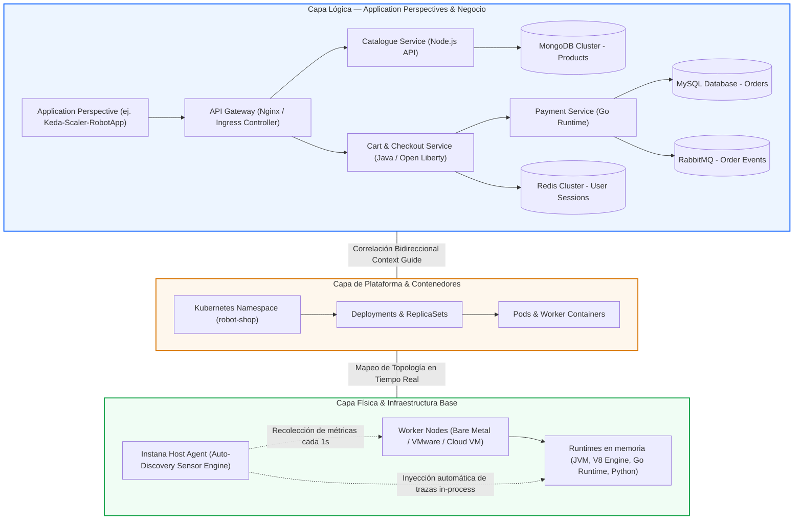

# **Workshop de Observabilidad y APM con IBM Instana**

---

## **Bienvenido al Hands-on Lab Definitivo de IBM Instana**

Bienvenido al workshop más completo y profundo sobre **IBM Instana Observability**. Este manual práctico e interactivo está diseñado para convertirte en un experto en la monitorización de rendimiento de aplicaciones (**APM**), análisis de sistemas distribuidos, diagnóstico de infraestructuras cloud-native y automatización de respuesta a incidentes basada en Inteligencia Artificial.

A través del entorno real **IBM Dev Sandbox**, explorarás cómo Instana resuelve los grandes retos de la ingeniería de confiabilidad de sitios (**SRE**) y DevOps: instrumentación automática sin código, recolección de métricas de infraestructura a resolución de **1 segundo**, captura del **100% de trazas sin muestreo (*No-Sampling*)**, y resolución de incidentes mediante el **Dynamic Graph** y el motor de **Root Cause Analysis (RCA)**.

???+ info "Acceso al Entorno de Pruebas (Sandbox)"
    Para realizar los ejercicios prácticos de este taller, utilizaremos el entorno compartido en la nube:
    
    * **URL de Acceso:** [`https://ibmdevsandbox-instanaibm.instana.io/#/home`](https://ibmdevsandbox-instanaibm.instana.io/#/home)
    * **Modo de Trabajo:** Análisis guiado y auditoría sobre clústeres reales en producción y aplicaciones de microservicios políglotas activas (*Stan's Robot Shop*, *Quote of the Day*, *OTel Demo*, pasarelas de pago, bases de datos y colas Kafka/RabbitMQ). No se requiere despliegue previo ni instalación local de agentes.

---

## **Estructura y Programa Completo del Workshop**

El taller está estructurado en 8 módulos especializados de dificultad técnica progresiva:

| Módulo | Título | Foco Técnico y Objetivos de Aprendizaje | ⏱ Duración |
| :--- | :--- | :--- | :--- |
| [**Lab 0**](lab0/index.md) | **Entorno, Consola y Dynamic Focus** | Arquitectura de Instana, navegación por la consola, control del *Time Picker* (*Live*, histórico y *Time-Shift*) y consultas universales con *Dynamic Focus*. | 15 min |
| [**Lab 1**](lab1/index.md) | **Infrastructure 3D, 1s Metrics & JVMs** | Topología 3D en tiempo real, cambio de perspectivas, telemetría a 1 segundo para capturar micro-picos, navegación de *Stack* y análisis forense de *JVMs*. | 20 min |
| [**Lab 2**](lab2/index.md) | **Application Perspectives & Service Flow** | Definición semántica de aplicaciones, grafo dinámico de dependencias (*Service Flow*), monitorización de *Golden Signals (RED)* y rendimiento de endpoints. | 20 min |
| [**Lab 3**](lab3/index.md) | **100% Tracing No-Sampling & Analytics** | Trazabilidad distribuida completa sin muestreo probabilístico, vista *Waterfall*, inspección de sentencias SQL/NoSQL y consultas masivas en *Unbounded Analytics*. | 20 min |
| [**Lab 4**](lab4/index.md) | **Incidentes, RCA & Change Events** | Eliminación de tormentas de alertas (*Alert Storms*), motor de correlación con IA, árbol de causa raíz (*Root Cause Tree*) y correlación con *Change Events* (Git/Rollouts). | 15 min |
| [**Lab 5**](lab5/index.md) | **SmartAlerts, SLOs & Custom Dashboards** | Configuración de *SmartAlerts* basados en Machine Learning, gestión de *Service Level Objectives (SLOs)*, *Error Budgets*, cálculo de *Burn Rate* y cuadros de mando. | 15 min |
| [**Lab 6**](lab6/index.md) | **Kubernetes & OpenShift Observability** | Observabilidad integral de clústeres K8s/OCP, mapeo de Namespaces, Deployments, Pods, Services, saturación de cuotas, CPU Throttling y eventos de Kube-State. | 15 min |
| [**Lab 7**](lab7/index.md) | **OpenTelemetry, SDK & Action Automation** | Ingesta de trazas y métricas OTel (OTLP), spans personalizados con SDK Java/Node, W3C TraceContext y ejecución de runbooks automatizados (*Action Framework*). | 15 min |

---

## **Arquitectura del Dynamic Graph: La Columna Vertebral de Instana**

A diferencia de las plataformas tradicionales que almacenan métricas, logs y trazas en silos desconectados, Instana fundamenta su arquitectura en el **Dynamic Graph**: un modelo de datos topológico y temporal en memoria que mantiene actualizadas segundo a segundo las dependencias entre el hardware físico, la virtualización, los contenedores y los servicios lógicos:

---

## **Los 5 Diferenciales Competitivos de IBM Instana**

-   :material-magnify-scan:{ .lg .middle } **1. Auto-Discovery (Zero-Code)**

    ---

    - Inyección dinámica de sensores sin reiniciar apps.
    - Detección automática de más de 300 tecnologías.
    - Mapeo continuo de dependencias en tiempo real.

-   :material-timer-outline:{ .lg .middle } **2. Granularidad de 1 Segundo**

    ---

    - Sin medias ni agregaciones de 1 a 5 minutos.
    - Detección exacta de micro-bursts de CPU y memoria.
    - Captura precisa del comportamiento en sistemas volátiles.

-   :material-target:{ .lg .middle } **3. 100% Tracing No-Sampling**

    ---

    - Captura íntegra de cada transacción distribuida.
    - Búsqueda exacta de trazas por ID de usuario o payload.
    - Auditoría matemática de SLAs y errores aislados.

-   :material-graph-outline:{ .lg .middle } **4. Dynamic Graph & RCA**

    ---

    - Modelo topológico temporal y en memoria.
    - Árbol de causa raíz generado automáticamente con IA.
    - Supresión instantánea de tormentas de alertas.

-   :material-open-source-initiative:{ .lg .middle } **5. Ecosistema Abierto & Acción**

    ---

    - Ingesta nativa OpenTelemetry (OTLP gRPC/HTTP).
    - Action Framework para remediación y runbooks.
    - Integración bidireccional con CI/CD y webhooks.

1. **Auto-Discovery e Instrumentación Automática (Zero-Code):** Un único agente por host o DaemonSet en Kubernetes descubre de forma transparente todos los procesos, puertos de red, bases de datos y runtimes en ejecución, comenzando a trazar peticiones sin requerir cambios de código ni reinicios manuales de aplicación.
2. **Granularidad de 1 Segundo:** Mientras la industria opera con agregaciones de 1 a 5 minutos (perdiendo picos de consumo que saturan sistemas efímeros), Instana recoge y visualiza telemetría de infraestructura a resolución de un segundo.
3. **100% Tracing Distribuido sin Muestreo (*No-Sampling*):** Ninguna petición es descartada. Si se produce un error crítico 500 una sola vez al día en un cliente VIP, Instana captura la traza completa con su payload SQL, headers y stack trace exacto.
4. **Root Cause Analysis (RCA) Inteligente:** Gracias al Dynamic Graph, Instana comprende la relación causal entre el agotamiento de recursos de infraestructura y la degradación de servicios, agrupando decenas de alertas aisladas en un único incidente claro.
5. **Automatización y Ecosistema Abierto:** Soporte nativo de estándares abiertos (**OpenTelemetry, W3C TraceContext, Prometheus**) y capacidades de autorreparación mediante el **Action Framework**.

---

[Comenzar el Workshop con el Lab 0 :octicons-arrow-right-24:](lab0/index.md){ .md-button .md-button--primary }
