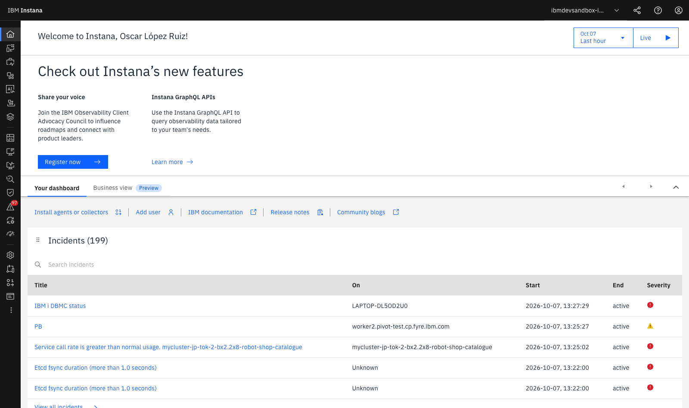
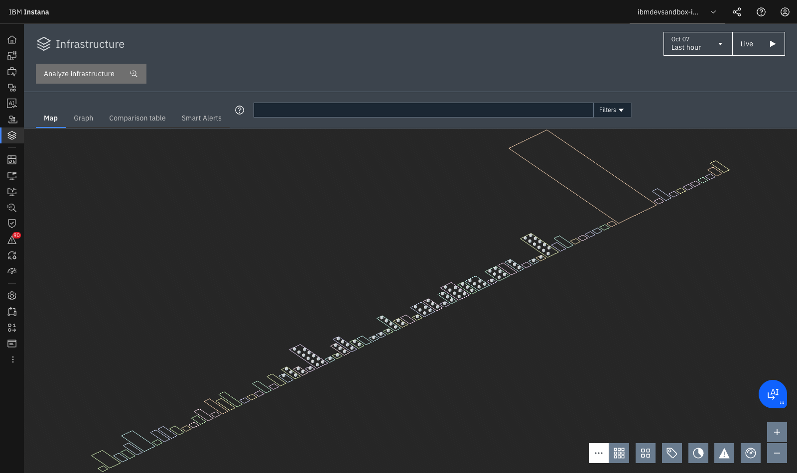

# **Lab 0 — Entorno, Consola y Dynamic Focus**

<span class="lab-badge">LAB 0</span><span class="lab-time">⏱ 15 minutos</span>

---

## **1. Fundamentos Teóricos de la Observabilidad Moderna**

La transición desde aplicaciones monolíticas hacia arquitecturas de microservicios distribuidos, contenedores efímeros y nubes híbridas ha transformado radicalmente la monitorización. En un entorno dinámico, los tres pilares clásicos de la observabilidad (Métricas, Logs y Trazas) resultan insuficientes si se analizan en silos desconectados.

**IBM Instana** introduce un paradigma centrado en la **Observabilidad Continua y Automatizada**, articulado en cuatro capacidades esenciales:

1. **Auto-Discovery Continuo:** Descubrimiento pasivo y activo de componentes físicos, lógicos y de red sin intervención humana.
2. **Dynamic Graph:** Un grafo temporal en memoria que mantiene actualizadas las dependencias vivas entre infraestructura y código.
3. **Métricas de Alta Fidelidad (Resolución de 1 segundo):** Captura instantánea de micro-ráfagas (*micro-bursts*) de CPU o memoria que los sistemas basados en promedios de 1 a 5 minutos ocultan.
4. **100% Tracing No-Sampling:** Cada transacción individual es registrada y contextualizada para auditoría y diagnóstico sin pérdida de información.

En este laboratorio inicial te familiarizarás con el entorno de trabajo (**IBM Dev Sandbox**), aprenderás a orientarte dentro de la interfaz gráfica, dominarás el control temporal y utilizarás el motor de búsqueda universal **Dynamic Focus**.

---

## **2. Acceso a la Consola de Instana Dev Sandbox**

1. Abre tu navegador web e ingresa en:
   [:octicons-link-external-24: https://ibmdevsandbox-instanaibm.instana.io/#/home](https://ibmdevsandbox-instanaibm.instana.io/#/home)
2. Inicia sesión a través del portal de identidad corporativo (SSO).
3. Tras la autenticación, accederás al panel de bienvenida (**Home Overview**):

<div class="screenshot-container">
  
  <div class="screenshot-caption">Figura 0.1: Pantalla inicial (Home Overview) en IBM Instana Sandbox mostrando incidentes activos y accesos directos.</div>
</div>

En esta pantalla inicial observarás:

* **Banner de Novedades y Comunidad:** Enlaces a las APIs de GraphQL, documentación oficial y release notes.
* **Incidentes Activos (Incidents Summary):** Resumen en tiempo real de anomalías correlacionadas en los clústeres del entorno (por ejemplo, alertas sobre llamadas a catálogos o estados de bases de datos).
* **Acceso a Instalación de Agentes:** El botón `Install agents or collectors` proporciona los comandos listos para desplegar agentes en Linux, Windows, macOS, Kubernetes, OpenShift o nubes públicas (AWS, Azure, GCP, IBM Cloud).

---

## **3. Módulos y Arquitectura de la Barra Lateral**

La consola de Instana organiza sus capacidades en una barra lateral izquierda de alto contraste:

| Icono / Módulo | Propósito y Capacidades Principales |
| :--- | :--- |
| **🏠 Home** | Resumen ejecutivo, incidentes abiertos en tiempo real y accesos rápidos a documentación y APIs GraphQL. |
| **🌐 Websites & mobile apps** | **Real User Monitoring (RUM)**. Monitoriza la experiencia de usuario final en navegadores web y apps móviles (iOS/Android), midiendo *Core Web Vitals* (LCP, FID, CLS), tiempos de renderizado y errores JavaScript. |
| **💼 Business processes** | Monitorización orientada a procesos de negocio (ej. *Checkout to Delivery*, *Loan Application Approval*) correlacionando múltiples servicios técnicos con KPIs de negocio. |
| **📱 Applications** | **Application Perspectives**. Agrupación lógica de servicios, APIs y microservicios con sus métricas RED (Rate, Errors, Duration) y mapas de dependencias. |
| **🤖 Gen AI observability** | Telemetría especializada para inferencias de **Large Language Models (LLMs)**, agentes watsonx, consumo de tokens, latencias de embedding y costos operativos. |
| **☁️ Platforms** | Monitorización nativa de plataformas de orquestación como **Kubernetes, Red Hat OpenShift, Cloud Foundry, VMware vSphere y Serverless (AWS Lambda)**. |
| **🗄️ Infrastructure** | **Infrastructure Map 3D**. Mapa físico y virtual de hosts, máquinas virtuales, procesos middleware (JVMs, Node.js, Go, Python) y bases de datos. |
| **📊 Custom dashboards** | Creación y consumo de cuadros de mando personalizados con widgets interactivos multidimensionales. |
| **📋 Logs** | Búsqueda y correlación contextual de registros de logs enlazados directamente con las trazas y los contenedores que los emitieron (*Logs in Context*). |
| **⏱️ Synthetic monitoring** | Ejecución periódica de pruebas sintéticas (HTTP checks, scripts de navegación de usuario) desde múltiples puntos de presencia globales para validar SLAs. |
| **🔍 Analytics** | **Unbounded Analytics**. Motor analítico que permite consultar, filtrar y agrupar miles de millones de trazas, llamadas y métricas de infraestructura sin límites de cardinalidad. |
| **🛡️ Vulnerabilities** | Análisis estático y dinámico de vulnerabilidades CVE en librerías cargadas en memoria por los runtimes monitorizados. |
| **⚠️ Events** | Registro consolidado de anomalías, advertencias, eventos de cambio (despliegues de Git, reinicios) e **Incidentes agrupados por IA**. |

---

## **4. El Selector de Ventana Temporal (Time Picker)**

En la esquina superior derecha se encuentra el control de tiempo, una herramienta clave para el análisis forense:

```text
┌─────────────────────────────────┐  ┌──────────┐
│  Oct 07 - Last hour          ▼  │  │  Live ▶  │
└─────────────────────────────────┘  └──────────┘
```

### Modos de Operación Temporal:

1. **Live Mode (Tiempo Real):**
   * Cuando el botón `Live ▶` está activo, la interfaz actualiza los gráficos automáticamente cada 1-5 segundos.
   * Es ideal para salas de operaciones (NOC/SRE) y monitorización durante despliegues en producción o pruebas de estrés.
2. **Preset Ranges (Ventanas predefinidas):**
   * `Last 10 minutes`, `Last hour`, `Last 24 hours`, `Last 7 days`, `Last 30 days`.
3. **Time Shift & Compare:**
   * Permite superponer la curva de rendimiento actual con la de la misma hora del día anterior o de la semana pasada para identificar desvíos de estacionalidad.
4. **Custom Window (Ventana absoluta):**
   * Permite fijar un intervalo específico (ej. `2026-10-07 13:15:00` a `2026-10-07 13:30:00`) para analizar un incidente pasado sin que el paso del tiempo altere los datos en pantalla.

---

## **5. Dominando la Dynamic Focus Bar (Consultas Lucene)**

La **Dynamic Focus Bar** situada en la cabecera superior permite transformar toda la interfaz de Instana aplicando filtros transversales que afectan instantáneamente a la infraestructura, los servicios, las trazas y las alertas.

<div class="screenshot-container">
  
  <div class="screenshot-caption">Figura 0.2: Barra de búsqueda universal Dynamic Focus con autocompletado contextual de entidades y tags.</div>
</div>

### Tabla de Sintaxis y Operadores:

| Operador / Sintaxis | Ejemplo de Uso | Descripción |
| :--- | :--- | :--- |
| **Exact match** | `entity.type:jvm` | Filtra solo procesos de Java Virtual Machine. |
| **Wildcard (`*`)** | `container.name:*catalogue*` | Coincidencia parcial con cualquier contenedor que contenga "catalogue". |
| **Operador AND** | `entity.zone:production AND entity.type:host` | Coincidencia simultánea de zona y tipo. |
| **Operador OR** | `call.http.status:500 OR call.http.status:502` | Coincidencia de cualquiera de los valores. |
| **Operador NOT** | `entity.type:host AND NOT entity.zone:test` | Excluye entidades que cumplan la condición. |
| **Comparación numérica** | `call.duration:>200ms` | Filtra llamadas con tiempo de respuesta superior a 200 ms. |
| **Rango numérico** | `call.http.status:[500 TO 599]` | Rango inclusivo de códigos de error 5xx. |

### Ejercicios Prácticos con Dynamic Focus:

!!! example "Ejercicio 1: Filtrar por tecnología de base de datos"
    En la Dynamic Focus Bar, escribe la siguiente consulta y presiona Enter:
    ```text
    entity.type:mongodb
    ```
    *Observa cómo la interfaz resalta exclusivamente las instancias de MongoDB activas en el entorno.*

!!! example "Ejercicio 2: Filtrar contenedores de la aplicación de pedidos"
    Limpia el filtro anterior y escribe:
    ```text
    container.name:*catalogue* OR container.name:*cart*
    ```
    *Esto aislará los contenedores de catálogo y carrito de compras en toda la topología.*

!!! example "Ejercicio 3: Aislar llamadas con error HTTP de servidor"
    Escribe:
    ```text
    call.http.status:>=500
    ```
    *Toda la telemetría se enfocará únicamente en las transacciones que han producido errores críticos 5xx.*

---

## **6. API de Automatización: GraphQL y REST API**

Instana está diseñado con una arquitectura **API-First**. Cualquier dato visible en la interfaz gráfica puede consultarse y automatizarse mediante sus APIs públicas:

### Consulta de Topología con GraphQL API
Instana expone un endpoint GraphQL en `https://<instana-unit>/graphql` que permite consultar el Dynamic Graph:

```graphql
query GetUnhealthyServices {
  application(id: "keda-scaler-robotapp") {
    name
    services {
      name
      health {
        status
        unresolvedIssuesCount
      }
      metrics {
        calls(window: "last-hour")
        erroneousCallRate(window: "last-hour")
        latency(window: "last-hour", aggregation: P95)
      }
    }
  }
}
```

---

## **7. Resumen y Checklist del Lab 0**

Al finalizar este laboratorio, has adquirido las competencias para:

* :white_check_mark: Iniciar sesión y autenticarte en el Sandbox de IBM Instana.
* :white_check_mark: Comprender el propósito de cada módulo en la barra de navegación lateral.
* :white_check_mark: Dominar el *Time Picker*, alternando entre el modo *Live* y ventanas históricas de análisis.
* :white_check_mark: Construir consultas complejas con la sintaxis de *Dynamic Focus* para filtrar el contexto de observabilidad.
* :white_check_mark: Conocer las capacidades de automatización vía API REST y GraphQL.

---

[Continuar al Lab 1: Infrastructure 3D, 1s Metrics & JVMs :octicons-arrow-right-24:](../lab1/index.md){ .md-button .md-button--primary }
