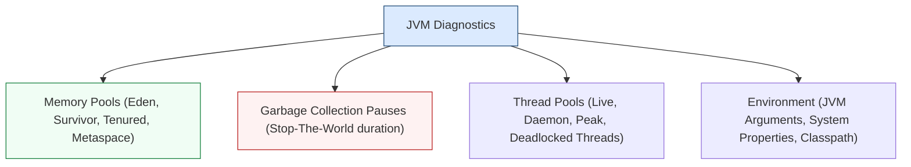

# **Lab 1 — Infrastructure 3D, 1s Metrics & JVMs**

<span class="lab-badge">LAB 1</span><span class="lab-time">⏱ 20 minutes</span>

---

## **1. Agent Architecture and the Dynamic Graph**

The Instana **Host Agent** operates through a modular sensor architecture that activates dynamically:

* **Infrastructure Sensor:** Collects hardware metrics at **1-second resolution** without overloading host CPU.
* **Runtime Sensors (Java, Node.js, Go, Python, .NET, PHP):** Hot-injected into active processes to instrument code and trace distributed transactions.
* **Middleware Sensors (Kafka, RabbitMQ, PostgreSQL, Db2, MySQL, Redis, MongoDB):** Queries internal performance metrics, connection pools, and queue lengths.

All this data continuously feeds the **Dynamic Graph**: an in-memory temporal topology model updating system dependencies:

```
Datacenter / Cloud Region  ➔  Host / VM  ➔  Container  ➔  Process (JVM/Node)  ➔  Service  ➔  Endpoint
```

---

## **2. Navigating the 3D Infrastructure Map**

1. In the left navigation menu, click **Infrastructure**.
2. The **3D Infrastructure Map** will render:

<div class="screenshot-container">
  
  <div class="screenshot-caption">Figure 1.1: Instana 3D Infrastructure Map displaying pillars (Hosts), stacked component boxes, and health state indicators.</div>
</div>

---

## **3. Anatomy of a Pillar in the 3D Map**

Every visual element conveys immediate structural and health context:

* **Zones (Perimeter boundaries):** Delimit physical or logical clusters (e.g., *Kubernetes Cluster mycluster-jp-tok*, *Production-AWS*, *On-Premises Fyre*).
* **Pillars (Vertical towers):** Represents a monitored **Host / Virtual Machine / Worker Node** running an Instana agent.
* **Stacked Boxes:** Each box inside a pillar represents an active **component or running process** (e.g., JVM process, Docker container, PostgreSQL database, Nginx web server).
* **Health Indicators:**
    * :white_check_mark: **Grey / White:** Healthy (Normal operation without resource saturation).
    * :warning: **Yellow:** Warning (e.g., elevated memory pressure or disk space depletion).
    * :octicons-x-circle-fill-16: **Red:** Critical error or active incident degrading business services.

---

## **4. Dynamic Perspectives and Groupings (Hosts vs Containers)**

In the bottom-right toolbar of the map, interactive controls allow restructuring the topology view:

<div class="screenshot-container">
  
  <div class="screenshot-caption">Figure 1.2: Perspective and dynamic grouping selector (by Zone, Container, Kubernetes Pod, or Technology).</div>
</div>

### Reorganization Exercise:

1. Click the **Perspective / Grouping** button (cube icon or `...` in the bottom bar).
2. Switch grouping to **Container**.
3. Observe how the map reorganizes instantly: pillars now represent Kubernetes pods or namespaces (`robot-shop`, `monitoring`, `kube-system`), offering a clear cloud-native perspective.

---

## **5. In-Depth Host Inspection and 1-Second Metrics**

1. At the top of the map, click **Comparison table** or click on any pillar to open the host sidebar and select **Open Dashboard**.

<div class="screenshot-container">
  
  <div class="screenshot-caption">Figure 1.3: Detailed Host Dashboard displaying 1-second resolution metrics and active process lists.</div>
</div>

2. **Real-Time System Telemetry (1-Second Granularity):**
    * **CPU Load & Usage:** Precise breakdown between `User`, `System`, `I/O Wait`, and `Steal CPU` (vital in multi-tenant cloud environments).
    * **Memory Utilization:** Breakdown between active resident memory, OS buffers, and page cache.
    * **Network Traffic & TCP Retransmissions:** Network layer bottleneck detection and dropped packet tracking.
    * **Disk Throughput & Latency:** Storage read/write throughput and IOPS latency.

---

## **6. Context Guide and Stack Viewer (From Hardware to Code)**

1. In the upper-left corner of the Host Dashboard, click the **Stack** button:

```text
┌────────────────────────────────────────────────────────┐
│  Stack ▼                                               │
├────────────────────────────────────────────────────────┤
│  ▲ Host: worker2.pivot-test.cp.fyre.ibm.com            │
│    └── Container: robot-shop-catalogue                 │
│          └── Process: node catalogue.js (PID: 1248)    │
│                └── Service: catalogue                  │
│                      └── Endpoint: GET /products       │
└────────────────────────────────────────────────────────┘
```

2. Click **Stack** to navigate up and down the Dynamic Graph:
   - In a single click, you can jump directly from physical host CPU metrics to the logical `catalogue` microservice and its live traces.

---

## **7. Runtime and JVM Forensic Diagnostics**

1. From the map or the Stack Viewer, select a **Java Virtual Machine (JVM)** or application server component (**Open Liberty / Tomcat**).
2. Explore specialized runtime telemetry tabs:



### Production Diagnostic Scenarios:

* **Memory Leak Detection:** Inspect the *Tenured (Old Gen)* memory graph. If post-GC baseline memory exhibits a continuous upward slope across successive collection cycles, a memory leak is occurring.
* **Stop-The-World GC Pauses:** If total GC time exceeds 5% of overall CPU time or individual pause durations exceed 500 ms, end-users will experience intermittent latency spikes.
* **Thread Deadlocks:** Instana automatically detects threads stuck in *BLOCKED* or *WAITING* states due to synchronized monitor contention.

---

## **8. Advanced Agent Configuration (`configuration.yaml`)**

The Instana Host Agent is configured via a centralized YAML configuration file:

```yaml
# /opt/instana/agent/etc/instana/configuration.yaml
com.instana.plugin.generic.hardware:
  enabled: true

# Custom zone and host tags
com.instana.plugin.host:
  tags:
    - environment: production
    - tier: backend
    - datacenter: madrid-dc1

# Trace HTTP header capture
com.instana.plugin.javatrace:
  custom-headers:
    - 'X-User-ID'
    - 'X-Correlation-ID'
```

---

## **9. Lab 1 Summary and Checklist**

Upon completing this lab, you have gained the skills to:

* :white_check_mark: Interpret the 3D infrastructure map and visual health indicators.
* :white_check_mark: Switch dynamic map groupings and perspectives (Hosts, Containers, and Namespaces).
* :white_check_mark: Analyze 1-second infrastructure telemetry to catch transient micro-bursts.
* :white_check_mark: Navigate the *Dynamic Graph* hierarchy from hardware to code using the *Stack Viewer*.
* :white_check_mark: Diagnose JVM runtimes (Heap pools, Garbage Collection pauses, and thread states).
* :white_check_mark: Understand agent configuration settings in `configuration.yaml`.

---

[Continue to Lab 2: Application Perspectives & Service Flow :octicons-arrow-right-24:](../lab2/index.md){ .md-button .md-button--primary }
