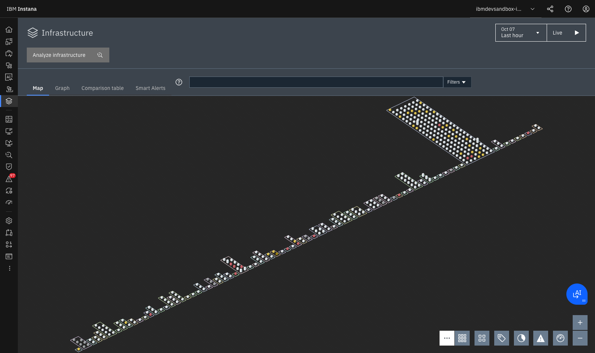
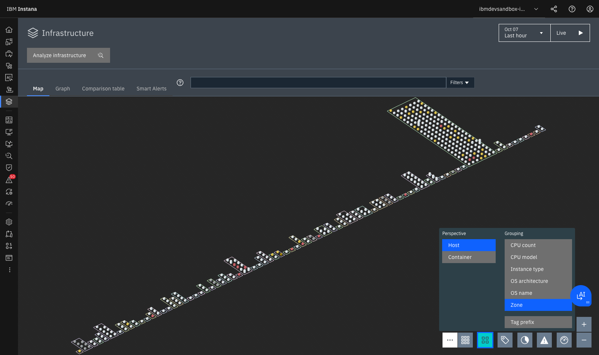
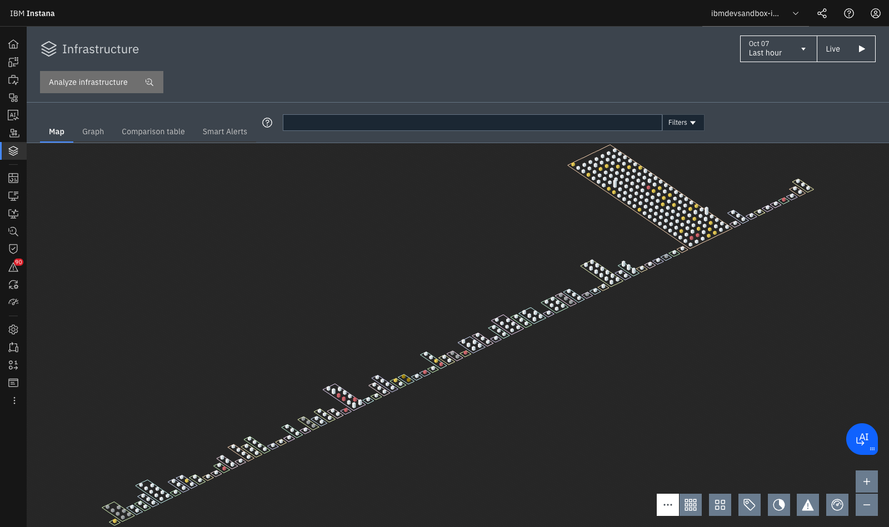
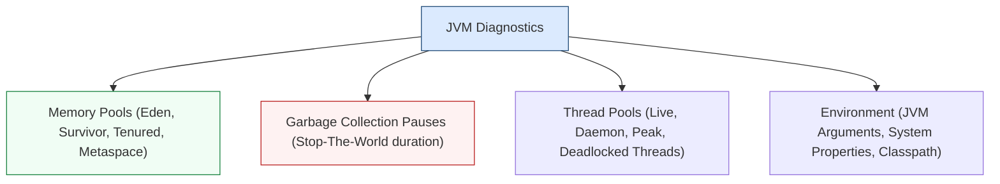

# **Lab 1 — Infrastructure 3D, 1s Metrics & JVMs**

<span class="lab-badge">LAB 1</span><span class="lab-time">⏱ 20 minutos</span>

---

## **1. Arquitectura del Agente y Dynamic Graph**

El **Host Agent** de Instana opera mediante una arquitectura de sensores modulares que se activan dinámicamente:

* **Sensor de Infraestructura:** Recolecta métricas de hardware a resolución de **1 segundo** sin saturar la CPU del host.
* **Sensores de Runtimes (Java, Node.js, Go, Python, .NET, PHP):** Se inyectan en caliente dentro de los procesos en ejecución para instrumentar el código y rastrear transacciones.
* **Sensores de Middleware (Kafka, RabbitMQ, PostgreSQL, Db2, MySQL, Redis, MongoDB):** Consultan estadísticas internas de rendimiento y contención de conexiones.

Toda esta información alimenta el **Dynamic Graph**: un modelo topológico vivo en memoria que mantiene actualizadas las dependencias:

```
Datacenter / Cloud Region  ➔  Host / VM  ➔  Container  ➔  Process (JVM/Node)  ➔  Service  ➔  Endpoint
```

---

## **2. Navegación al Mapa de Infraestructura 3D**

1. En el menú lateral izquierdo, haz clic en **Infrastructure**.
2. Aparecerá el **Infrastructure Map 3D**:

<div class="screenshot-container">
  
  <div class="screenshot-caption">Figura 1.1: Mapa 3D de Infraestructura en Instana con pilares (Hosts), cajas de procesos/contenedores y códigos de salud.</div>
</div>

---

## **3. Anatomía de un Pilar en el Mapa 3D**

Cada elemento del mapa transmite información inmediata sobre topología y estado de salud:

* **Zonas (Líneas perimetrales):** Delimitan clústeres físicos o lógicos (ej. *Kubernetes Cluster mycluster-jp-tok*, *Production-AWS*, *On-Premises Fyre*).
* **Pilar (Columna vertical):** Representa un **Host / Máquina Virtual / Nodo Worker** que ejecuta un agente de Instana.
* **Cajas / Bloques apilados:** Cada bloque dentro del pilar representa un **componente o proceso en ejecución** (ej. Proceso JVM, Contenedor Docker, Base de datos PostgreSQL/MySQL, Servidor Web Nginx).
* **Semáforo de Salud:**
    * :white_check_mark: **Gris / Blanco:** Saludable (OK sin anomalías ni saturación).
    * :warning: **Amarillo:** Advertencia / Warning (ej. uso elevado de memoria o saturación de disco).
    * :octicons-x-circle-fill-16: **Rojo:** Error crítico o incidente activo que impacta al servicio de negocio.

---

## **4. Perspectivas y Agrupación Dinámica (Hosts vs Contenedores)**

En la barra de herramientas inferior derecha del mapa encontrarás controles interactivos para reestructurar la topología:

<div class="screenshot-container">
  
  <div class="screenshot-caption">Figura 1.2: Selector de perspectiva y agrupación dinámica (por Zona, Contenedor, Pod de Kubernetes o Tecnología).</div>
</div>

### Ejercicio de Reorganización:

1. Haz clic en el botón de **Perspective / Grouping** (icono de cubos o `...` en la barra inferior).
2. Cambia la agrupación a **Container**.
3. Observa cómo el mapa transmuta instantáneamente: ahora los pilares representan pods o namespaces de Kubernetes (`robot-shop`, `monitoring`, `kube-system`), facilitando la visión de arquitecturas cloud-native.

---

## **5. Inspección Detallada de un Host y Métricas a 1 Segundo**

1. En la parte superior del mapa, haz clic en **Comparison table** o pulsa sobre un pilar para abrir el panel lateral del host y hacer clic en **Open Dashboard**.

<div class="screenshot-container">
  
  <div class="screenshot-caption">Figura 1.3: Panel detallado de un nodo con métricas a resolución de 1 segundo y desglose de procesos activos.</div>
</div>

2. **Telemetría de Sistema en Tiempo Real (Resolución de 1 segundo):**
    * **CPU Load & Usage:** Diferenciación precisa entre `User`, `System`, `I/O Wait` y `Steal CPU` (esencial en máquinas virtuales compartidas).
    * **Memory Utilization:** Desglose entre memoria usada real, buffers y memoria en caché del kernel.
    * **Network Traffic & TCP Retransmissions:** Detección de problemas de capa de red y pérdida de paquetes.
    * **Disk Throughput & Latency:** Métricas de lectura/escritura en disco e IOPS.

---

## **6. El Context Guide y Stack Viewer (Del Hardware al Código)**

1. En la esquina superior izquierda del Host Dashboard, localiza el botón **Stack**:

```text
┌────────────────────────────────────────────────────────┐
│  Stack ▼                                               │
├────────────────────────────────────────────────────────┤
│  ▲ Host: worker2.pivot-test.cp.fyre.ibm.com            │
│    └── Container: robot-shop-catalogue                 │
│          └── Process: node catalogue.js (PID: 1248)    │
│                └── Service: catalogue                  │
│                      └── Endpoint: GET /products       │
└────────────────────────────────────────────────────────┘
```

2. Haz clic en **Stack** y observa cómo Instana te permite ascender o descender en el grafo:

   - Puedes saltar en un solo clic desde el uso de CPU del nodo físico directamente al servicio de microservicios `catalogue` y a sus trazas.

---

## **7. Diagnóstico Forense de Runtimes y JVMs**

1. Desde el mapa o el Stack, selecciona un componente de **Java Virtual Machine (JVM)** o servidor de aplicaciones (**Open Liberty / Tomcat**).
2. Explora las pestañas de telemetría especializada en runtimes:



### Casos de Diagnóstico en Producción:

* **Detección de Fugas de Memoria (Memory Leaks):** Observa la gráfica de la memoria *Tenured (Old Gen)*. Si tras sucesivos ciclos de Garbage Collection la línea base de memoria ocupada sigue una pendiente ascendente continua, existe una fuga de memoria (objetos retenidos en colecciones estáticas o pools).
* **Pausas de Recolección de Basura (Stop-The-World GC Pauses):** Si el tiempo dedicado a GC supera el 5% del tiempo total de CPU o se observan pausas mayores a 500 ms, los usuarios experimentarán picos de latencia intermitentes.
* **Bloqueos de Hilos (Thread Deadlocks):** Instana detecta automáticamente hilos en estado *BLOCKED* o *WAITING* por contención de monitores sincronizados.

---

## **8. Configuración Avanzada del Agente (`configuration.yaml`)**

El agente de Instana se personaliza mediante su fichero de configuración centralizado:

```yaml
# /opt/instana/agent/etc/instana/configuration.yaml
com.instana.plugin.generic.hardware:
  enabled: true

# Configuración de zona personalizada
com.instana.plugin.host:
  tags:

    - environment: production
    - tier: backend
    - datacenter: madrid-dc1

# Filtrado de trazas HTTP por cabeceras
com.instana.plugin.javatrace:
  custom-headers:

    - 'X-User-ID'
    - 'X-Correlation-ID'
```

---

## **9. Resumen y Checklist del Lab 1**

Al finalizar este laboratorio, has adquirido las competencias para:

* :white_check_mark: Interpretar el mapa tridimensional de infraestructura y los códigos visuales de salud.
* :white_check_mark: Cambiar las agrupaciones y perspectivas del mapa (Hosts, Contenedores y Namespaces).
* :white_check_mark: Analizar métricas de infraestructura a resolución de 1 segundo para capturar micro-picos.
* :white_check_mark: Navegar a través de la jerarquía completa del *Dynamic Graph* utilizando el *Stack Viewer*.
* :white_check_mark: Diagnosticar la salud interna de JVMs (Heap pools, Garbage Collection y Threads).
* :white_check_mark: Conocer las opciones de configuración del agente en `configuration.yaml`.

---

[Continuar al Lab 2: Application Perspectives & Service Flow :octicons-arrow-right-24:](../lab2/index.md){ .md-button .md-button--primary }
