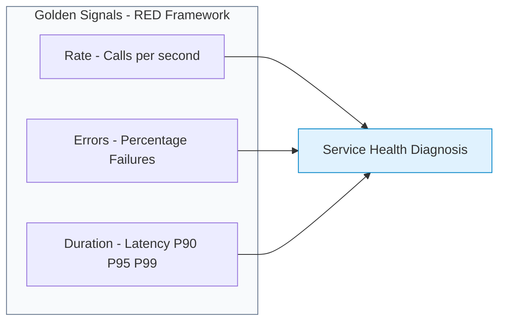

# **Lab 2 — Application Perspectives & Service Flow**

LAB 2⏱ 20 minutes

---

## **1. What is an Application Perspective?**

In modern microservice architectures with hundreds of ephemeral pods and containers distributed across multi-cloud clusters, physical host boundaries become secondary to the **logical business service perspective**.

An **Application Perspective (AP)** in Instana is a semantic, dynamic, and infrastructure-decoupled view grouping services based on tags (*tags*), such as:

* **Environment:** `environment:production`, `environment:staging`, or `environment:dev`.
* **Kubernetes Namespace:** `kubernetes.namespace:robot-shop`.
* **Business Domain:** `domain:banking`, `domain:ecommerce`, `domain:logistics`.
* **Geographic Region / Cloud Provider:** `cloud.provider:aws`, `cloud.region:eu-west-1`.

---

## **2. Application Catalog in the Sandbox**

1. In the left navigation menu, click **Applications**.
2. You will see the global catalog of active Application Perspectives in the environment:

  
  
Figure 2.1: Application Perspectives catalog showing call volume (Calls), average latency, error rate, and calculated health state.

3. Observe the summary metrics in the table:

    * **Services:** Number of automatically discovered microservices composing the application (e.g., 43 services in `Keda-Scaler-RobotApp`).
    * **Calls (Sparkline):** Transaction volume and trend curve (e.g., ~288,000 calls/hour).
    * **Latency:** Mean response time (e.g., 57 ms).
    * **Erroneous call rate:** Percentage of failed calls (e.g., 0.54%).
    * **Health:** AI-computed overall health evaluating open alerts and incidents.

---

## **3. Interactive Service Dependency Flow**

1. Click on **Keda-Scaler-RobotApp** or **Robot Shop - EP**.
2. Select the **Dependencies** tab in the top navigation bar:

  
  
Figure 2.2: Interactive dependency graph and call flow in Keda-Scaler-RobotApp (Nginx, Catalogue, Cart, MongoDB, Redis, MySQL, RabbitMQ).

3. **Dependency Graph Capabilities:**
    * **Automated Topology Discovery:** Instana discovers connections by inspecting tracing headers across all network calls (HTTP, gRPC, JDBC, AMQP) with zero manual configuration.
    * **Animated Traffic Flow:** Animated particle streams indicate live request flow direction (*Upstream* ➔ *Downstream*).
    * **Technology Classification:** Visually distinguishes microservices, databases (`mongodb`, `redis`, `mysql`), message brokers (`rabbitmq`, `kafka`), and third-party SaaS endpoints (`paypal.com`, `aws.amazon.com`).

---

## **4. Microservices Catalog and RED Signals**

1. Click the **Services** tab inside the application view.
2. The complete microservice breakdown will appear with their corresponding Golden Signals (*Golden Signals*):

  
  
Figure 2.3: Microservices breakdown with individual RED metrics (catalogue, cart, payment, shipping, user).

3. **The 4 Golden Signals (RED Framework) in Instana:**

* **Rate (Throughput / Call Volume):** Measures inbound demand. Enables detection of traffic drops from upstream gateway outages or sudden spikes from DDoS/flash sales.
* **Errors (Erroneous Call Rate):** Percentage of requests resulting in unhandled exceptions or HTTP 5xx errors.
* **Duration (Latency and Percentiles):** Instana calculates not just mean response times, but critical percentiles: **P90, P95, and P99**. A service averaging 30 ms can suffer a P99 of 2,000 ms severely degrading top active customers.

---

## **5. Endpoint-Level Performance Inspection**

1. Click on the **catalogue** (or **cart**) service.
2. Select the **Endpoints** tab:

  
  
Figure 2.4: HTTP REST endpoints view for the catalogue service showing latency and request distribution.

3. Observe how Instana categorizes each exposed REST route (e.g., `GET /products`, `GET /product/{id}`, `POST /product`).
4. Clicking any endpoint opens its latency histogram and allows direct drilling into individual traces exceeding acceptable thresholds.

---

## **6. Correlating Logs in Context (Logs in Context)**

From any microservice or endpoint view, click the **Log messages** tab:

* Instana eliminates the need for separate standalone log management tools.
* Displays strictly the logs generated by instances of that specific service during the selected timeframe.
* `ERROR` and `WARN` log entries link directly to their corresponding `Trace ID`, enabling one-click jumps straight into the offending code execution path.

---

## **7. Lab 2 Summary and Checklist**

Upon completing this lab, you have gained the skills to:

* :white_check_mark: Create and structure logical *Application Perspectives*.
* :white_check_mark: Interpret the dynamic dependency graph (*Service Dependency Flow*).
* :white_check_mark: Identify dependencies across datastores (`MongoDB`, `MySQL`, `Redis`) and messaging systems (`RabbitMQ`).
* :white_check_mark: Analyze Golden Signals (*RED Metrics*) and latency percentiles (P95/P99).
* :white_check_mark: Correlate distributed traces with *Logs in Context*.

---

[Continue to Lab 3: 100% Tracing No-Sampling & Analytics :octicons-arrow-right-24:](../lab3/index.md){ .md-button .md-button--primary }
