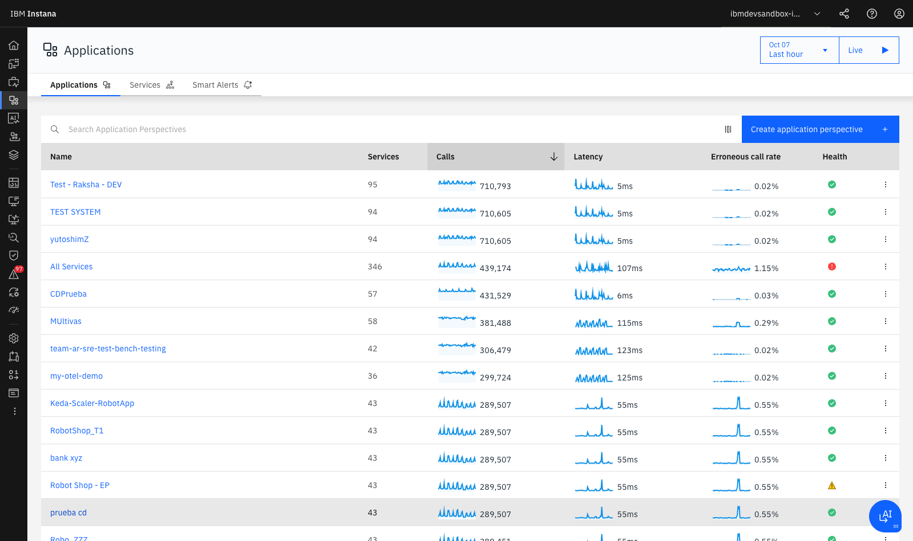
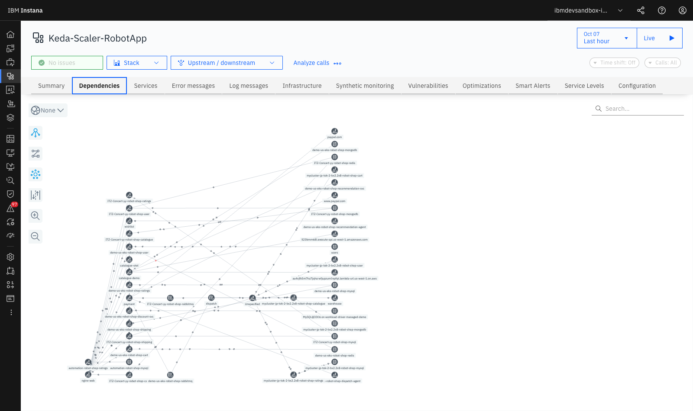
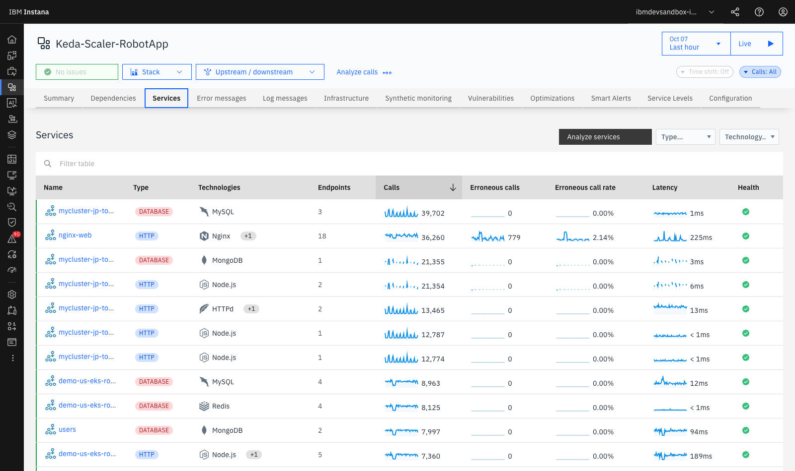
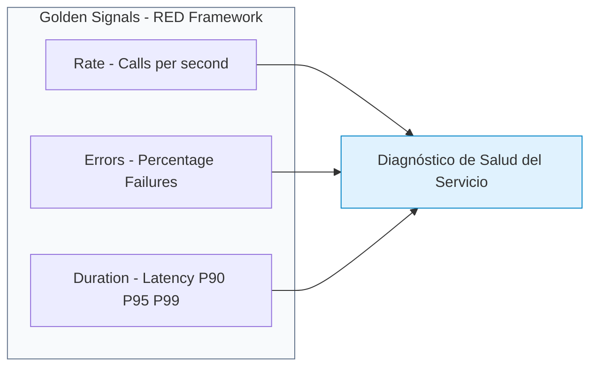
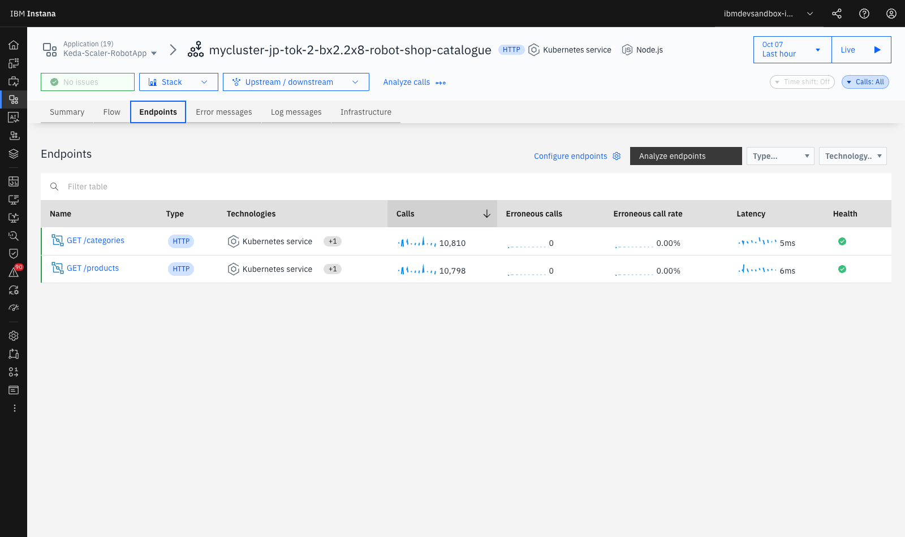

# **Lab 2 — Application Perspectives & Service Flow**

LAB 2⏱ 20 minutos

---

## **1. ¿Qué es una Application Perspective?**

En arquitecturas modernas de microservicios con cientos de pods efímeros y contenedores distribuidos en múltiples clústeres, la noción de "servidor físico" pierde relevancia frente a la **perspectiva lógica del servicio de negocio**.

Una **Application Perspective (AP)** en Instana es una vista semántica, dinámica y desacoplada de la infraestructura física que agrupa servicios basándose en etiquetas (*tags*), como:

* **Entorno:** `environment:production`, `environment:staging` o `environment:dev`.
* **Namespace de Kubernetes:** `kubernetes.namespace:robot-shop`.
* **Dominio funcional de negocio:** `domain:banking`, `domain:ecommerce`, `domain:logistics`.
* **Región geográfica o nube:** `cloud.provider:aws`, `cloud.region:eu-west-1`.

---

## **2. Catálogo de Aplicaciones en el Sandbox**

1. En el menú de navegación izquierdo, haz clic en **Applications**.
2. Verás el catálogo global de perspectivas de aplicación activas en el entorno:

  
  
Figura 2.1: Catálogo de Application Perspectives con volumen de llamadas (Calls), Latencia media, Tasa de errores y estado de salud.

3. Observa las métricas sintetizadas en la tabla:

    * **Services:** Cantidad de microservicios descubiertos automáticamente que componen la aplicación (ej. 43 servicios en `Keda-Scaler-RobotApp`).
    * **Calls (Sparkline):** Tendencia y volumen total de transacciones (ej. ~288.000 llamadas/hora).
    * **Latency:** Tiempo medio de respuesta (ej. 57 ms).
    * **Erroneous call rate:** Porcentaje de llamadas fallidas (ej. 0.54%).
    * **Health:** Evaluación global de salud calculada por IA combinando alertas e incidentes.

---

## **3. El Grafo Interactivo de Dependencias (Service Dependency Flow)**

1. Haz clic sobre **Keda-Scaler-RobotApp** o **Robot Shop - EP**.
2. Selecciona la pestaña **Dependencies** en la barra superior:

  
  
Figura 2.2: Grafo interactivo de dependencias y flujo de llamadas en Keda-Scaler-RobotApp (Nginx, Catalogue, Cart, MongoDB, Redis, MySQL, RabbitMQ).

3. **Capacidades del Grafo de Dependencias:**
    * **Auto-Discovery de Topología:** Instana descubre las conexiones analizando las cabeceras de tracing en cada llamada de red (HTTP, gRPC, JDBC, AMQP). No requiere configuración manual previa.
    * **Flujo Animado de Tráfico:** Las partículas y flechas animadas indican la dirección de las peticiones (*Upstream* ➔ *Downstream*).
    * **Clasificación Tecnológica:** Distingue visualmente entre microservicios, bases de datos (`mongodb`, `redis`, `mysql`), brokers de mensajería (`rabbitmq`, `kafka`) y servicios externos SaaS (`paypal.com`, `aws.amazon.com`).

---

## **4. Desglose y Análisis del Catálogo de Microservicios**

1. Haz clic en la pestaña **Services** dentro de la aplicación.
2. Observarás la lista completa de microservicios con sus señales doradas (*Golden Signals*):

  
  
Figura 2.3: Desglose de servicios de la aplicación con métricas RED individuales (catalogue, cart, payment, shipping, user).

3. **Las 4 Señales Doradas (RED Metrics) en Instana:**

* **Rate (Llamadas / Throughput):** Mide la demanda sobre el servicio. Permite detectar caídas bruscas por caídas de pasarelas o picos de tráfico por ataques de denegación de servicio.
* **Errors (Tasa de llamadas erróneas):** Porcentaje de respuestas con excepciones no controladas o códigos de estado HTTP 5xx.
* **Duration (Latencia y Percentiles):** Instana calcula no solo la media, sino los percentiles críticos **P90, P95 y P99**. Esto es vital: un servicio con media de 30 ms puede tener un P99 de 2.000 ms afectando al 1% de los clientes más activos.

---

## **5. Inspección a Nivel de Endpoints de un Servicio**

1. Haz clic sobre el servicio **catalogue** (o **cart**).
2. Selecciona la pestaña **Endpoints**:

  
  
Figura 2.4: Vista de endpoints HTTP del servicio catalogue con desglose de latencia y volumen de peticiones.

3. Observa cómo Instana categoriza cada ruta REST expuesta (ej. `GET /products`, `GET /product/{id}`, `POST /product`).
4. Al hacer clic en un endpoint concreto, puedes consultar su distribución de latencia y acceder directamente a las trazas individuales que superaron el umbral aceptable.

---

## **6. Correlación de Logs en Contexto (Logs in Context)**

Dentro de la vista de cualquier microservicio o endpoint, haz clic en la pestaña **Log messages**:

* Instana no requiere que abras una herramienta separada de gestión de logs.
* Muestra únicamente los logs generados por las instancias de ese servicio durante la ventana temporal seleccionada.
* Los logs con nivel `ERROR` o `WARN` están vinculados directamente con el `Trace ID` correspondiente para saltar con un clic al código causante.

---

## **7. Resumen y Checklist del Lab 2**

Al finalizar este laboratorio, has adquirido las competencias para:

* :white_check_mark: Crear y estructurar *Application Perspectives* lógicas.
* :white_check_mark: Interpretar el grafo dinámico de dependencias (*Service Dependency Flow*).
* :white_check_mark: Identificar dependencias con componentes de almacenamiento (`MongoDB`, `MySQL`, `Redis`) y mensajería (`RabbitMQ`).
* :white_check_mark: Analizar las señales doradas (*RED Metrics*) y los percentiles de latencia (P95/P99).
* :white_check_mark: Correlacionar trazas y llamadas con *Logs in Context*.

---

[Continuar al Lab 3: 100% Tracing No-Sampling & Analytics :octicons-arrow-right-24:](../lab3/index.md){ .md-button .md-button--primary }
