# **Lab 3 — 100% Tracing No-Sampling & Analytics**

LAB 3⏱ 20 minutes

---

## **1. Foundations of Distributed Tracing in Instana**

**Distributed Tracing** is the mechanism that reconstructs the end-to-end journey of an incoming request across microservices, network boundaries, asynchronous messaging queues, and databases.

### The Key Differentiator: **100% No-Sampling**
The overwhelming majority of APM vendors employ *Head-based* or *Tail-based Sampling*, discarding up to 99% of raw traces to cut storage costs. **Instana captures and processes 100% of calls**.

| Comparison Dimension | Traditional APM Tools | IBM Instana |
| :--- | :--- | :--- |
| **Sampling Rate** | 1% to 5% (Probabilistic sampling) | **100% Complete (No-Sampling)** |
| **Rare Error Detection** | Very low (1 in 1,000 failure is lost) | **100% Guaranteed (Zero blind spots)** |
| **Auditing by Customer ID** | Impossible if the trace wasn't sampled | **Instant lookup by any Tag or Payload** |
| **Percentile Accuracy (P99)** | Statistical extrapolation | **Mathematically Exact** |

---

## **2. Accessing Unbounded Analytics**

1. In the left navigation menu, click **Analytics**.
2. Select the **Applications / Calls** or **Traces** perspective:

  
  
Figure 3.1: Unbounded Analytics interface processing over 1,750,000 calls with real-time Throughput (Calls sum), Erroneous calls rate, and Mean latency charts.

3. Observe the three synchronized top telemetry panels:

    * **Calls (sum):** Bar chart tracking total processed request volume.
    * **Erroneous calls rate (mean):** Red-highlighted bar chart revealing error anomalies.
    * **Latency (mean / P95):** Latency distribution over the selected time window.

---

## **3. Advanced Querying and Tag Filtering**

In **Unbounded Analytics**, you can combine any infrastructure dimension, application tag, or HTTP payload attribute via dynamic filters:

  
  
Figure 3.2: Waterfall view of a distributed transaction showing SQL queries, nested HTTP sub-calls, and infrastructure correlation.

### Practical Analytics Exercises:

!!! example "Exercise 1: Filter Database Calls with Latency > 20ms"
    1. Click **Add filter +**.
    2. Configure the parameters:
       * `call.type` = `database`
       * `call.duration` > `20ms`
    3. Observe how Instana isolates slow queries across MySQL, PostgreSQL, and MongoDB.

!!! example "Exercise 2: Group Failures by Service and Endpoint"
    1. In the top query bar, click **Add group +** and select `service.name`.
    2. Add a second grouping level with `endpoint.name`.
    3. Add the filter `call.erroneous = true`.
    4. *Result:* An exact ranking of which endpoints cause the highest failure rate for your users.

---

## **4. Anatomy of a Trace in Waterfall View**

Click on any transaction row in the table to open the detailed trace viewer:

```mermaid
gantt
    title Span Breakdown in /cart/checkout Transaction (Total: 145ms)
    dateFormat X
    axisFormat %s ms

    section Web Gateway
    HTTP Entry GET /cart/checkout : 0, 145
    
    section Cart Service
    Node.js Intermediate processOrder : 10, 140
    Redis GET user_session : 15, 30
    
    section Payment Service
    HTTP Exit POST /payment/charge : 35, 120
    MySQL UPDATE balance : 50, 85
    PayPal External API : 85, 115
    
    section Notification
    RabbitMQ Message Publish : 125, 140
```

### Forensic Elements in the Trace:

1. **Spans and Call Types:**
   * **Entry Span (Blue):** Inbound request arriving at a microservice (starting boundary).
   * **Intermediate Span (Grey):** In-process runtime execution or annotated method execution.
   * **Exit Span (Orange/Red):** Outbound call to a database, external API, or message queue.
2. **SQL & Query Payloads:**
   * Click on any database span (`MySQL` or `MongoDB`).
   * The right-hand panel displays the sanitized SQL statement (`UPDATE users SET last_login = ...`), target database name, and execution duration.
3. **Asynchronous Messaging (Kafka & RabbitMQ):**
   * Instana propagates trace context through Kafka headers and AMQP properties, tracing asynchronous message handoffs from producer to consumer.
4. **Exceptions and Stack Traces:**
   * When a span fails (red indicator), clicking it opens the full runtime *Stack Trace* (Java, Node.js, Python) with source file names and exact line numbers.

---

## **5. Lab 3 Summary and Checklist**

Upon completing this lab, you have gained the skills to:

* :white_check_mark: Understand the business value of 100% distributed tracing without sampling (*No-Sampling*).
* :white_check_mark: Leverage *Unbounded Analytics* to execute high-performance analytical queries across millions of spans.
* :white_check_mark: Slice and group transactions across multi-cardinality metadata tags.
* :white_check_mark: Troubleshoot performance bottlenecks in *Waterfall* views across SQL queries, third-party HTTP calls, Kafka/RabbitMQ queues, and code exceptions.

---

[Continue to Lab 4: Incidents, RCA & Change Events :octicons-arrow-right-24:](../lab4/index.md){ .md-button .md-button--primary }
