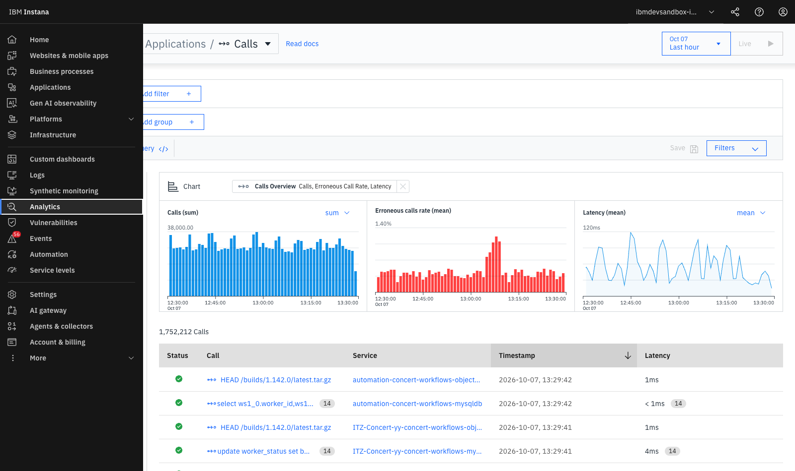
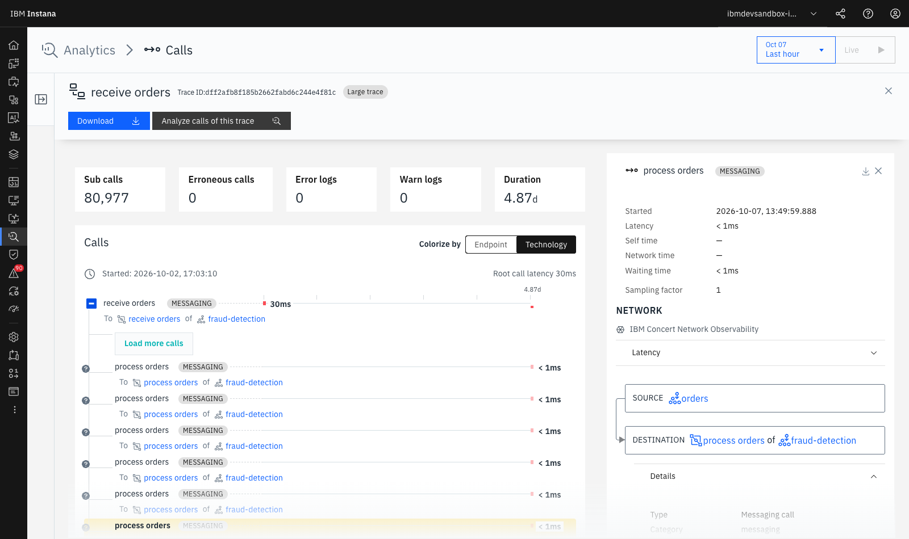

# **Lab 3 — 100% Tracing No-Sampling & Analytics**

LAB 3⏱ 20 minutos

---

## **1. Fundamentos del Tracing Distribuido en Instana**

El **Distributed Tracing** es el mecanismo que permite reconstruir el viaje completo de una petición a través de múltiples microservicios, capas de red, colas asíncronas y bases de datos.

### El Diferencial Clave de Instana: **100% No-Sampling**
La inmensa mayoría de herramientas APM utilizan *Head-based* o *Tail-based Sampling*, descartando hasta el 99% de las trazas para ahorrar almacenamiento. **Instana rastrea y procesa el 100% de las llamadas**.

| Comparativa | Herramientas APM Tradicionales | IBM Instana |
| :--- | :--- | :--- |
| **Tasa de Muestreo (Sampling)** | 1% a 5% (Muestreo probabilístico) | **100% Completo (No-Sampling)** |
| **Detección de errores esporádicos** | Muy baja (1 error entre 1.000 se pierde) | **100% garantizado (Cero puntos ciegos)** |
| **Auditoría por ID de Cliente** | Inviable si la traza no fue muestreada | **Búsqueda inmediata por cualquier Tag/Payload** |
| **Exactitud en Percentiles (P99)** | Aproximada por extrapolación | **Matemáticamente exacta** |

---

## **2. Acceso a Unbounded Analytics**

1. En el menú lateral izquierdo, haz clic en **Analytics**.
2. Selecciona la perspectiva **Applications / Calls** o **Traces**:

  
  
Figura 3.1: Interfaz de Unbounded Analytics procesando más de 1.750.000 llamadas con gráficos de Throughput (Calls sum), Erroneous calls rate y Latency mean.

3. Observa los tres paneles superiores sincronizados en tiempo real:

    * **Calls (sum):** Gráfico de barras con el volumen total de peticiones procesadas.
    * **Erroneous calls rate (mean):** Gráfico de barras rojas que resalta anomalías de errores.
    * **Latency (mean / P95):** Distribución de latencias a lo largo de la ventana temporal.

---

## **3. Consultas y Filtrado Avanzado por Etiquetas (Tags)**

En **Unbounded Analytics**, puedes combinar cualquier dimensión de infraestructura, aplicación o payload HTTP mediante filtros dinámicos:

  
  
Figura 3.2: Vista en cascada (Waterfall) de una transacción distribuida con sub-llamadas SQL, HTTP y correlación de infraestructura.

### Ejercicios Prácticos de Analítica:

!!! example "Ejercicio 1: Filtrar todas las llamadas a bases de datos con latencia > 20ms"
    1. Haz clic en **Add filter +**.
    2. Configura los parámetros:

       * `call.type` = `database`
       * `call.duration` > `20ms`
    3. Observa cómo Instana aísla únicamente las consultas lentas a MySQL, PostgreSQL y MongoDB.

!!! example "Ejercicio 2: Agrupar fallos por Servicio y Endpoint"
    1. En la barra superior, haz clic en **Add group +** y selecciona `service.name`.
    2. Añade un segundo nivel de agrupación con `endpoint.name`.
    3. Añade el filtro `call.erroneous = true`.
    4. *Resultado:* Obtendrás un ranking exacto de qué endpoints generan el mayor impacto negativo en tus usuarios.

---

## **4. Anatomía de una Traza en Vista Cascada (Waterfall)**

Haz clic sobre cualquiera de las transacciones en la tabla para abrir el visor de traza:

```mermaid
gantt
    title Desglose de Spans en Transacción /cart/checkout (Total: 145ms)
    dateFormat X
    axisFormat %s ms

    section Web Gateway
    HTTP Entry GET /cart/checkout : 0, 145
    
    section Cart Service
    Node.js Intermediate processOrder : 10, 140
    Redis GET user_session : 15, 30
    
    section Payment Service
    HTTP Exit POST /payment/charge : 35, 120
    MySQL UPDATE balance : 50, 85
    PayPal External API : 85, 115
    
    section Notification
    RabbitMQ Message Publish : 125, 140
```

### Elementos de Diagnóstico en la Traza:

1. **Spans y Tipos de Llamada:**
   * **Entry Span (Azul):** Entrada de la petición al microservicio (punto de inicio).
   * **Intermediate Span (Gris):** Procesamiento interno en el runtime o ejecución de método anotado.
   * **Exit Span (Naranja/Rojo):** Llamada saliente a una base de datos, API externa o cola de mensajes.
2. **SQL & Query Payloads:**
   * Haz clic sobre un span de base de datos (`MySQL` o `MongoDB`).
   * En el panel derecho verás la sentencia SQL completa sanitizada (`UPDATE users SET last_login = ...`), la base de datos de destino y el tiempo exacto que tardó el motor de BD en responder.
3. **Mensajería Asíncrona (Kafka & RabbitMQ):**
   * Instana propaga el contexto de tracing a través de las cabeceras de los mensajes de Kafka y RabbitMQ, permitiendo rastrear el flujo asíncrono desde el productor hasta el consumidor.
4. **Excepciones y Stack Traces:**
   * Si un span falla (marcado con barra roja), haz clic sobre él para desplegar el *Stack Trace* completo del lenguaje (Java, Node.js, Python), con el nombre del fichero y el número de línea exacto donde ocurrió el error.

---

## **5. Resumen y Checklist del Lab 3**

Al finalizar este laboratorio, has adquirido las competencias para:

* :white_check_mark: Comprender el valor del tracing distribuido al 100% sin muestreo (*No-Sampling*).
* :white_check_mark: Utilizar *Unbounded Analytics* para construir consultas analíticas sobre millones de registros.
* :white_check_mark: Segmentar y agrupar transacciones por múltiples etiquetas de alta cardinalidad.
* :white_check_mark: Diagnosticar cuellos de botella en la vista *Waterfall*, analizando sentencias SQL, llamadas HTTP externas, colas Kafka/RabbitMQ y excepciones de código.

---

[Continuar al Lab 4: Incidentes, RCA & Change Events :octicons-arrow-right-24:](../lab4/index.md){ .md-button .md-button--primary }
