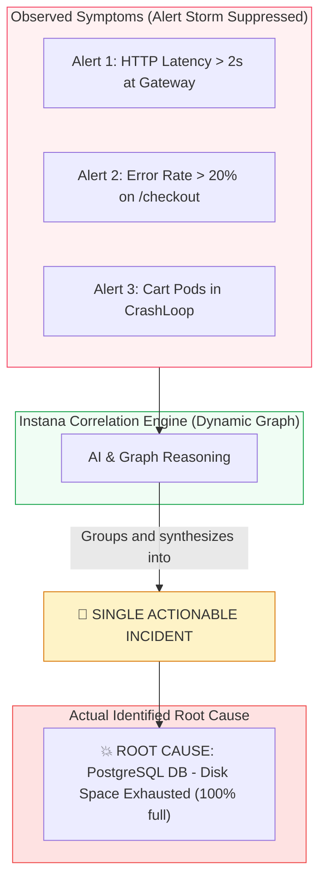
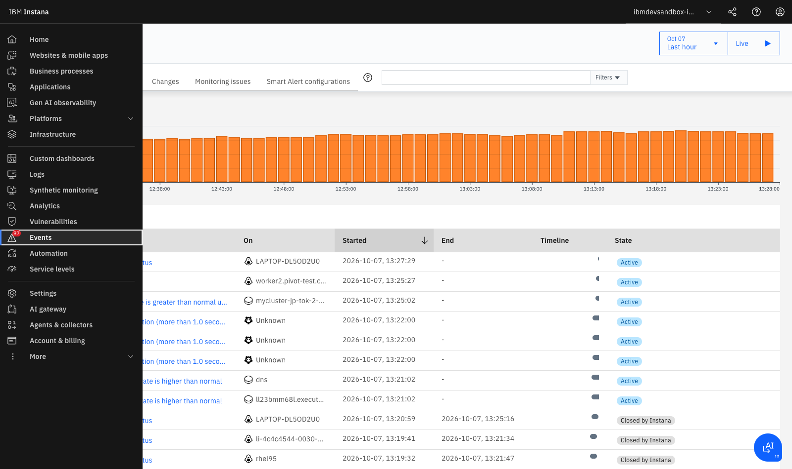
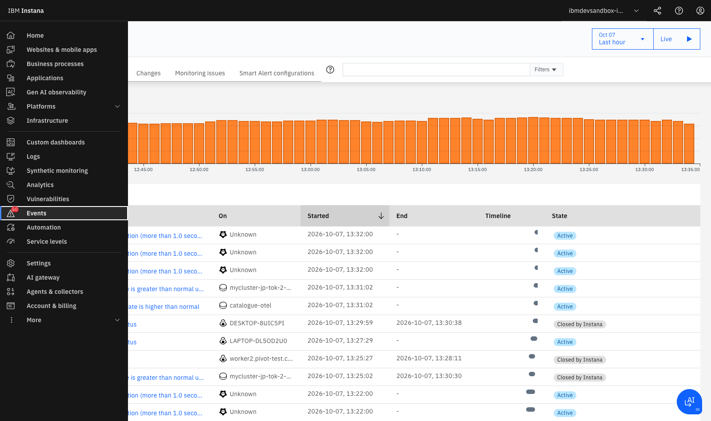

# **Lab 4 — Events, Incidents, and Root Cause Analysis (RCA)**

<span class="lab-badge">LAB 4</span><span class="lab-time">⏱ 15 minutes</span>

---

## **1. The Problem of Alert Fatigue**

In traditional architectures running dozens of microservices across Kubernetes clusters, an outage in a database or top-of-rack network switch triggers an "alert storm":

- The database generates connection pool exhaustion alerts.
- 15 dependent microservices fire timeout and HTTP 500 alerts.
- The API Gateway fires P99 latency alerts.
- Kubernetes triggers readiness probe failure and CrashLoopBackOff alerts.

**Result:** The on-call SRE team receives over 80 simultaneous notifications in Slack or PagerDuty, spending hours determining which alert represents the actual root cause.

---

## **2. Instana's AI Correlation and Incident Engine**

Instana eliminates alert fatigue through its **AI-powered Dynamic Graph correlation engine**:



### Event Classification in Instana:

* **Changes:** State modifications across the environment (e.g., Git code deploy, environment variable change, Kubernetes pod replica scaling).
* **Issues:** Isolated infrastructure anomalies that do not yet impact end-user transactions (e.g., CPU at 85% on a secondary worker node).
* **Incidents:** Contextual grouping of multiple Issues and Changes where **a critical service or business KPI is degraded**.

---

## **3. Navigating the Events & Incidents Center**

1. In the left navigation menu, click **Events** (or **Events & Incidents**).
2. The global anomaly timeline and active incident table will render:

<div class="screenshot-container">
  
  <div class="screenshot-caption">Figure 4.1: Events and Incidents Center in Instana showing the global activity timeline and table with Active / Closed states.</div>
</div>

3. Review the informative table columns:

    * **Event / Title:** Summary description (e.g., *Service call rate is greater than normal usage*, *Etcd fsync duration*, *IBM i DBMC status*).
    * **On (Entity):** Exact impacted host, container, or component (e.g., `mycluster-jp-tok-2-bx2.2x8-robot-shop-catalogue`, `worker2.pivot-test...`).
    * **Started / End:** Timestamp of detection and resolution.
    * **Timeline / State:** Visual duration bar and lifecycle state (`Active` or `Closed by Instana`).

---

## **4. Incident Investigation and the Root Cause Tree**

1. Click on any active incident row to open its detailed triage view:

<div class="screenshot-container">
  
  <div class="screenshot-caption">Figure 4.2: Incident detail view displaying impacted entity and correlated telemetry timeline.</div>
</div>

2. **Root Cause Tree Diagnostics:**
   Instana traverses the dependency graph from outward symptoms down to the root cause component:

```text
🔴 INCIDENT: Keda-Scaler-RobotApp — Service Call Rate Anomaly on /catalogue
   │
   ├── ⚠️ Frontend Symptom: nginx-web (HTTP 502 Bad Gateway error rate)
   │     │
   │     └── ⚠️ Intermediate Service: catalogue (Node.js API timeouts)
   │           │
   │           └── 💥 ROOT CAUSE: MongoDB - Connection Pool Exhausted 
   │                 (Host: worker2.pivot-test... / RAM: 98% saturation)
```

---

## **5. Correlating Change Events with Incidents**

A critical superpower of Instana is temporal correlation with change events:

1. Along the incident timeline, observe deployment markers and change event flags.
2. Clicking a change marker reveals:
   - *Deploy Event:* Container image deployment `robot-shop-catalogue:v2.1.0`.
   - *Author & Commit:* GitHub commit author, hash, and pull request summary.
3. This empowers SREs to answer questions in seconds:

> 💡 *"The database connection failures began exactly 45 seconds after deploying commit abc1234"*

### Programmatic Release Marker Registration via REST API

Inject deployment markers directly from your CI/CD pipeline (GitHub Actions, GitLab CI, Tekton, Jenkins) by sending an HTTP POST request to the Instana API:

```bash
curl -X POST \
  https://ibmdevsandbox-instanaibm.instana.io/api/releases \
  -H "Authorization: apiToken ${INSTANA_API_TOKEN}" \
  -H "Content-Type: application/json" \
  -d '{
    "name": "Release v2.1.0 - Robot Shop Catalogue",
    "start": '$(date +%s000)',
    "services": [
      {
        "name": "catalogue"
      }
    ]
  }'
```

---

## **6. Guided Hands-on Exercise: Real Incident Triage**

Perform the following step-by-step investigation in the Instana console:

1. **Filter Incidents:** In the **Events** menu, toggle both `Closed` and `Active` states.
2. **Search Events:** In the query box, search for `catalogue` or `Service call rate is greater than normal usage`.
3. **Assess Severity:** Identify the icon severity (Yellow for *Warning / Issue*, Red for *Critical / Incident*).
4. **Navigate to the Entity:** Click the associated entity link to open the host/container infrastructure view at the exact timestamp when degradation occurred.
5. **Inspect Correlated Metrics:** Observe how CPU, memory, and call rate charts automatically lock onto the incident's timeframe.

---

## **7. Lab 4 Summary and Checklist**

Upon completing this lab, you have gained the skills to:

* :white_check_mark: Understand the distinction between *Changes*, *Issues*, and *Incidents*.
* :white_check_mark: Navigate the events center and chronological activity timeline.
* :white_check_mark: Interpret the *Root Cause Analysis (RCA)* tree to diagnose outages in minutes.
* :white_check_mark: Correlate incidents with software deployments (*Change Events*).

---

[Continue to Lab 5: SmartAlerts, SLOs & Custom Dashboards :octicons-arrow-right-24:](../lab5/index.md){ .md-button .md-button--primary }
