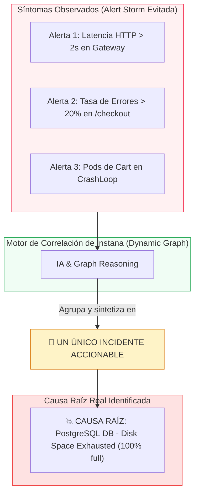

# **Lab 4 — Eventos, Incidentes y Root Cause Analysis (RCA)**

<span class="lab-badge">LAB 4</span><span class="lab-time">⏱ 15 minutos</span>

---

## **1. El Problema de la Fatiga de Alertas (Alert Fatigue)**

En arquitecturas tradicionales con docenas de microservicios y clústeres Kubernetes, la caída de una base de datos o un switch de red desencadena una "tormenta de alertas":

- La base de datos emite alerta de conexiones saturadas.
- 15 microservicios dependientes emiten alertas de timeout y errores 500.
- El API Gateway emite alertas de latencia.
- Kubernetes emite alertas de readiness probes fallidas y reinicios en bucle (*CrashLoopBackOff*).

**Resultado:** El equipo de guardia recibe más de 80 notificaciones simultáneas en Slack o PagerDuty y tarda horas en averiguar cuál de todas es la causa origen.

---

## **2. El Motor de Correlación e Incidentes de Instana**

Instana resuelve la fatiga de alertas mediante su **Motor de Inteligencia Artificial basado en el Dynamic Graph**:



### Clasificación de Eventos en Instana:

* **Changes (Cambios):** Modificaciones de estado en el sistema (ej. despliegue de nueva versión de código Git, cambio en variables de entorno, escalado de réplicas de Pods).
* **Issues (Problemas):** Anomalías aisladas de infraestructura que aún no impactan a los usuarios finales (ej. uso de CPU al 85% en un nodo secundario).
* **Incidents (Incidentes):** Agrupación contextualizada de múltiples Issues y Changes donde **un servicio o KPI de negocio crítico está degradado**.

---

## **3. Navegación por el Centro de Events & Incidents**

1. En el menú de navegación izquierdo, haz clic en **Events** (o **Events & Incidents**).
2. Verás la línea temporal global de anomalías y la lista de incidentes:

<div class="screenshot-container">
  
  <div class="screenshot-caption">Figura 4.1: Centro de Incidentes y Eventos en Instana mostrando la línea de tiempo de actividad y la tabla con estados Active / Closed.</div>
</div>

3. Observa las columnas informativas:

    * **Event / Title:** Resumen del problema (ej. *Service call rate is greater than normal usage*, *Etcd fsync duration*, *IBM i DBMC status*).
    * **On (Entity):** Componente, host o contenedor exacto afectado (ej. `mycluster-jp-tok-2-bx2.2x8-robot-shop-catalogue`, `worker2.pivot-test...`).
    * **Started / End:** Marca temporal de inicio y resolución.
    * **Timeline / State:** Indicador gráfico de duración y estado (`Active` o `Closed by Instana`).

---

## **4. Análisis de un Incidente y Árbol de Causa Raíz (Root Cause Tree)**

1. Haz clic sobre uno de los incidentes activos en la lista para acceder a su panel detallado:

<div class="screenshot-container">
  
  <div class="screenshot-caption">Figura 4.2: Vista detallada del incidente con componente afectado y telemetría correlacionada.</div>
</div>

2. **Diagnóstico del Árbol de Causa Raíz:**
   Instana utiliza el grafo de dependencias para navegar desde el síntoma hasta el componente origen:

```text
🔴 INCIDENTE: Keda-Scaler-RobotApp — Service Call Rate Anomaly en /catalogue
   │
   ├── ⚠️ Síntoma en Frontend: nginx-web (Tasa de error 502 Bad Gateway)
   │     │
   │     └── ⚠️ Servicio Intermedio: catalogue (Node.js API con timeouts)
   │           │
   │           └── 💥 CAUSA RAÍZ: MongoDB - Connection Pool Exhausted 
   │                 (Host: worker2.pivot-test... / RAM: 98% saturation)
```

---

## **5. Correlación con Eventos de Cambio (Change Events)**

Uno de los factores más potentes de Instana es la correlación temporal con eventos de cambio:

1. En la línea temporal del incidente, observa los marcadores circulares y banderas de despliegue.
2. Al hacer clic sobre un marcador de cambio verás:

   - *Deploy Event:* Despliegue de imagen Docker `robot-shop-catalogue:v2.1.0`.
   - *Author & Commit:* Autor del commit en GitHub y mensaje del pull request.
3. Esto permite a los ingenieros de confiabilidad (SREs) responder en segundos:

> 💡 *"El fallo de base de datos comenzó exactamente 45 segundos después del despliegue del commit abc1234"*

### Registro Programático de Release Markers mediante API REST

Puedes inyectar marcadores de despliegue directamente desde tu pipeline de CI/CD (GitHub Actions, GitLab CI, Tekton o Jenkins) enviando una petición HTTP POST a la API de Instana:

```bash
curl -X POST \
  https://ibmdevsandbox-instanaibm.instana.io/api/releases \
  -H "Authorization: apiToken ${INSTANA_API_TOKEN}" \
  -H "Content-Type: application/json" \
  -d '{
    "name": "Release v2.1.0 - Robot Shop Catalogue",
    "start": '$(date +%s000)',
    "services": [
      {
        "name": "catalogue"
      }
    ]
  }'
```

---

## **6. Ejercicio Práctico Guiado: Triaje de un Incidente Real**

En la consola de Instana, realiza el siguiente ejercicio de investigación paso a paso:

1. **Filtrar Incidentes:** En el menú **Events**, activa el selector de estado en `Closed` y `Active`.
2. **Buscar el Evento:** En la barra de búsqueda escribe `catalogue` o `Service call rate is greater than normal usage`.
3. **Analizar la Severidad:** Identifica el código de color del icono (Amarillo para *Warning / Issue*, Rojo para *Critical / Incident*).
4. **Navegar a la Entidad:** Haz clic en el enlace de la entidad asociada para abrir la perspectiva de infraestructura del host/contenedor en el momento exacto en que ocurrió la degradación.
5. **Inspeccionar Métricas Correlacionadas:** Observa cómo los gráficos de CPU, memoria y tasa de llamadas se ajustan automáticamente a la ventana temporal del incidente.

---

## **7. Resumen y Checklist del Lab 4**

Al finalizar este laboratorio, has adquirido las competencias para:

* :white_check_mark: Comprender la jerarquía entre *Changes*, *Issues* e *Incidents*.
* :white_check_mark: Navegar por el centro de eventos y la línea temporal de actividad.
* :white_check_mark: Interpretar el árbol de *Root Cause Analysis (RCA)* para diagnosticar averías en minutos.
* :white_check_mark: Correlacionar incidentes con despliegues de software (*Change Events*).

---

[Continuar al Lab 5: SmartAlerts, SLOs y Custom Dashboards :octicons-arrow-right-24:](../lab5/index.md){ .md-button .md-button--primary }
