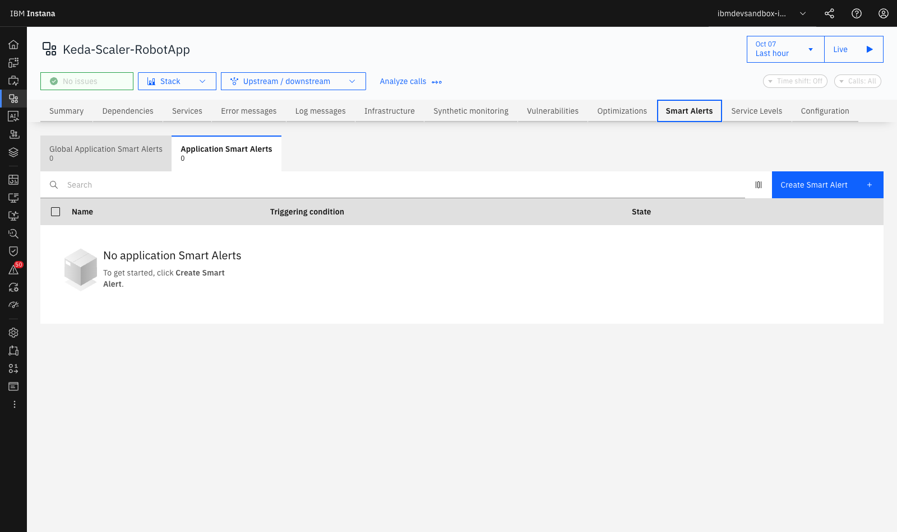
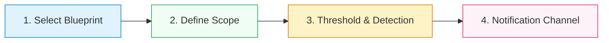
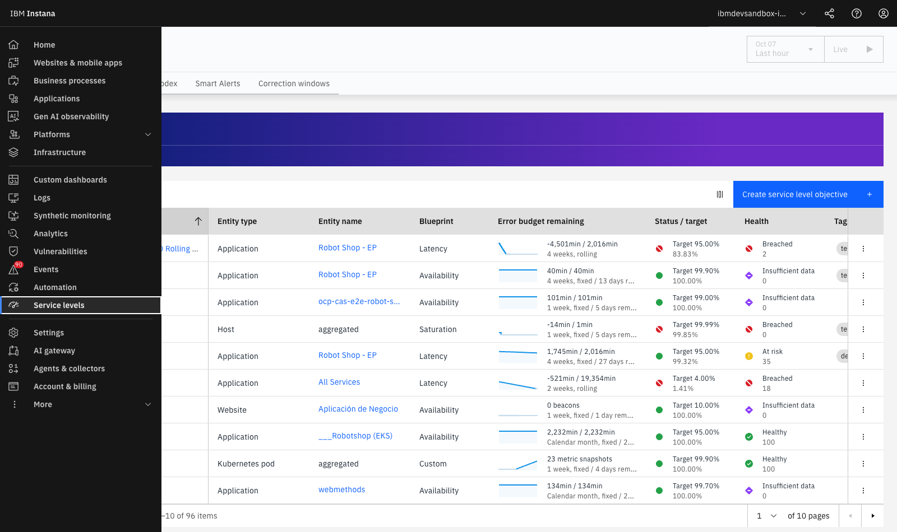
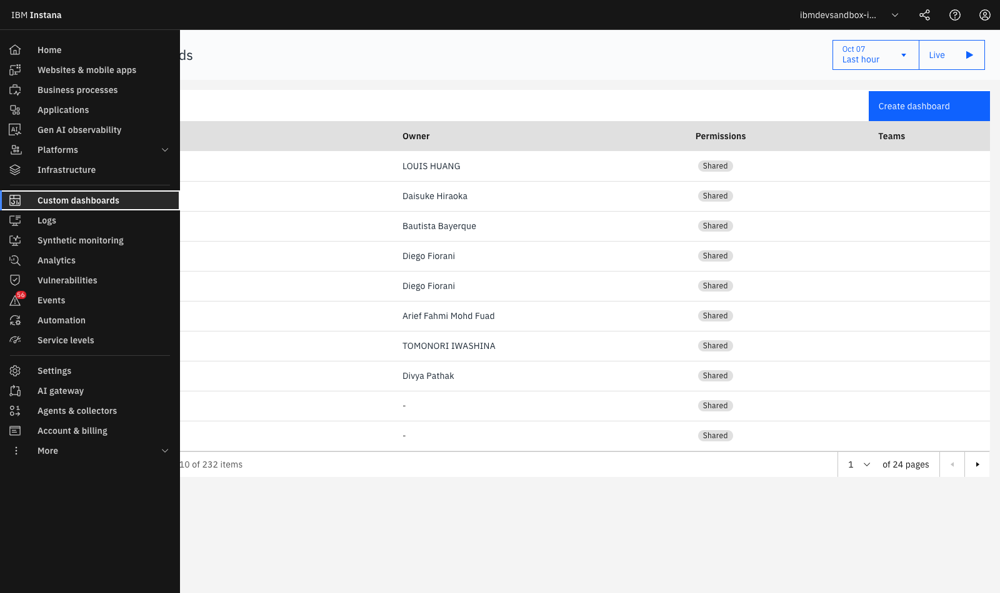

# **Lab 5 — SmartAlerts, SLOs & Custom Dashboards**

LAB 5⏱ 15 minutes

---

## **1. Static Thresholds vs AI-Powered SmartAlerts**

Traditional static alerts based on fixed thresholds (e.g., *"alert if CPU > 80%"* or *"alert if latency > 200ms"*) generate two critical issues:

1. **False Positives:** Noisy notifications during expected nightly batch processing or anticipated traffic spikes.
2. **False Negatives:** Complete failure to alert if a critical microservice degrades at 03:00 AM on Sunday because the static threshold was sized for peak daytime traffic.

**IBM Instana SmartAlerts** solves this through **Machine Learning algorithms** that continuously model the baseline behavior of each endpoint and service, factoring in daily and weekly seasonality.

---

## **2. Step-by-Step SmartAlert Configuration**

1. Go to **Applications** > Select **Keda-Scaler-RobotApp** or **Robot Shop - EP**.
2. Click the **Smart Alerts** tab:

  
  
Figure 5.1: SmartAlerts configuration interface inside the application view offering pre-built out-of-the-box blueprints.

### The 4-Step SmartAlert Wizard:

* **Step 1 — Predefined Blueprints:**
    * **Slow Calls (Latency):** Detects degradation across P90, P95, or P99 latency percentiles.
    * **Erroneous Calls (Error Rate):** Detects abnormal increases in HTTP 5xx errors or code exceptions.
    * **Throughput Drop / Sudden Spike:** Uncovers abrupt traffic drop-offs or unexpected demand surges.
    * **HTTP Status Codes:** Targets specific error codes (e.g., 401 Unauthorized or 429 Too Many Requests).
* **Step 2 — Scope:**
    * Entire application (`All Services`) or critical bounded contexts (`payment`, `cart`).
* **Step 3 — Threshold & Detection Method:**
    * **Dynamic Baseline (AI):** Machine learning continuously computes dynamic statistical tolerance boundaries based on time of day and day of week.
    * **Static Threshold:** Fixed ceiling if strict contractual SLAs apply (e.g., > 300 ms).
* **Step 4 — Alert Channels:**
    * Real-time dispatch to **Slack, Microsoft Teams, Webhooks, ServiceNow, PagerDuty, Splunk On-Call, or Email**.

---

## **3. Service Level Objectives (SLOs) and Error Budgets**

1. In the application header menu, click the **Service levels** (or **SLOs**) tab:

  
  
Figure 5.2: Service Levels (SLOs) dashboard tracking objective fulfillment and Error Budget consumption.

### Core SRE Concepts in Instana:

* **Service Level Indicator (SLI):** The technical measurement metric (e.g., latency of `GET /cart` < 100 ms).
* **Service Level Objective (SLO):** The committed business target (e.g., 99.5% fast transactions over a 7-day rolling window).
* **Error Budget:** The tolerable margin of failure (100% - 99.5% = 0.5%).
* **Burn Rate:** The rate at which the error budget is consumed. If the *Burn Rate* exceeds 14.4x, Instana warns that the monthly budget will be fully depleted within 2 hours without immediate mitigation.

---

## **4. Building Custom Dashboards**

1. In the left navigation menu, click **Custom dashboards**:

  
  
Figure 5.3: Custom Dashboards catalog shared across cross-functional development, operations, and executive teams.

2. **Creating an Executive Dashboard:**
    * Click **Create dashboard**.
    * Enter Title: `Executive Dashboard - E-Commerce Health`.
    * Add interactive widgets:
        * **Time-Series Chart:** Global throughput alongside P95 latency trend curves.
        * **Single Big Metric (KPI):** Global application availability percentage (99.98%).
        * **Top List Widget:** Top 5 slowest backend microservices.
        * **Infrastructure Heatmap:** CPU and Memory saturation heatmap across Kubernetes cluster nodes.

---

## **5. Lab 5 Summary and Checklist**

Upon completing this lab, you have gained the skills to:

* :white_check_mark: Configure *SmartAlerts* using pre-built blueprints and AI *Dynamic Baselines*.
* :white_check_mark: Define and monitor *Service Level Objectives (SLOs)*, *SLIs*, and *Error Budgets*.
* :white_check_mark: Interpret *Burn Rate* metrics to proactively protect business SLAs.
* :white_check_mark: Construct customized operational and executive *Custom Dashboards*.

---

[Continue to Lab 6: Kubernetes & OpenShift Observability :octicons-arrow-right-24:](../lab6/index.md){ .md-button .md-button--primary }
