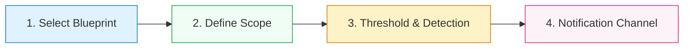

# **Lab 5 — SmartAlerts, SLOs y Custom Dashboards**

LAB 5⏱ 15 minutos

---

## **1. Alertas Tradicionales vs SmartAlerts con IA**

Las alertas estáticas basadas en umbrales fijos (ej. *"avisar si CPU > 80%"* o *"avisar si latencia > 200ms"*) generan dos problemas graves:

1. **Falsos Positivos:** Notificaciones innecesarias durante procesos batch nocturnos o picos esperados de tráfico.
2. **Falsos Negativos:** No alertan si un servicio crítico cae a las 03:00 AM un domingo porque el umbral fijo estaba calculado para el tráfico diurno.

**IBM Instana SmartAlerts** resuelve esto mediante **modelos de Machine Learning** que aprenden el comportamiento normal de cada endpoint y servicio, incorporando estacionalidad diaria y semanal.

---

## **2. Configuración de un SmartAlert paso a paso**

1. Ve a **Applications** > Selecciona **Keda-Scaler-RobotApp** o **Robot Shop - EP**.
2. Haz clic en la pestaña **Smart Alerts**:

  
  
Figura 5.1: Panel de SmartAlerts dentro de la aplicación con opciones para añadir alertas inteligentes basadas en blueprints.

### El Asistente de Configuración (4 Pasos):

* **Step 1 — Blueprints Predefinidos:**
    * **Slow Calls (Latencia):** Detección de degradación en percentiles P90, P95 o P99.
    * **Erroneous Calls (Tasa de fallos):** Aumento anormal de respuestas 5xx o excepciones.
    * **Throughput Drop / Sudden Spike:** Detección de caídas abruptas de clientes o sobrecargas inesperadas.
    * **HTTP Status Codes:** Detección de códigos de estado concretos (ej. 401 Unauthorized o 429 Too Many Requests).
* **Step 2 — Scope (Ámbito):**
    * Toda la aplicación (`All Services`) o servicios críticos (`payment`, `cart`).
* **Step 3 — Threshold & Detection Method:**
    * **Dynamic Baseline (IA):** El algoritmo ajusta automáticamente la banda de tolerancia estadística según la hora y día de la semana.
    * **Static Threshold:** Umbral fijo si existe un SLA contractual estricto (ej. > 300 ms).
* **Step 4 — Alert Channels:**
    * Envío instantáneo a **Slack, Microsoft Teams, Webhook, ServiceNow, PagerDuty, Splunk On-Call o Email**.

---

## **3. Gestión de Service Level Objectives (SLOs) y Error Budgets**

1. En el menú superior de la aplicación, haz clic en la pestaña **Service levels** (o **SLOs**):

  
  
Figura 5.2: Panel de Service Levels (SLOs) monitorizando el cumplimiento de objetivos y el consumo de Error Budget.

### Conceptos Clave de SRE en Instana:

* **Service Level Indicator (SLI):** La métrica técnica medida (ej. latencia de `GET /cart` < 100 ms).
* **Service Level Objective (SLO):** El objetivo comprometido con el negocio (ej. 99.5% de transacciones rápidas en una ventana móvil de 7 días).
* **Error Budget (Presupuesto de Error):** El margen de fallos tolerado (100% - 99.5% = 0.5%).
* **Burn Rate:** La velocidad a la que se consume el presupuesto. Si el *Burn Rate* supera 14.4x, Instana alerta de que el presupuesto de error del mes se agotará en las próximas 2 horas si no se mitiga la incidencia.

---

## **4. Construcción de Custom Dashboards**

1. En el menú lateral izquierdo, haz clic en **Custom dashboards**:

  
  
Figura 5.3: Catálogo de cuadros de mando personalizados compartidos entre equipos de desarrollo y operaciones.

2. **Creación de un Cuadro de Mando Ejecutivo:**
    * Haz clic en **Create dashboard**.
    * Asigna el título: `Executive Dashboard - E-Commerce Health`.
    * Añade widgets interactivos combinando métricas:

        * **Time-Series Chart:** Throughput global y curva de latencia P95.
        * **Single Big Metric (KPI):** Porcentaje de disponibilidad general (99.98%).
        * **Top List Widget:** Top 5 microservicios con mayor tiempo de respuesta.
        * **Infrastructure Heatmap:** Mapa de saturación de CPU/Memoria en los nodos Kubernetes.

---

## **5. Resumen y Checklist del Lab 5**

Al finalizar este laboratorio, has adquirido las competencias para:

* :white_check_mark: Configurar *SmartAlerts* basadas en blueprints predefinidos con modelos de *Dynamic Baseline*.
* :white_check_mark: Definir y monitorizar *Service Level Objectives (SLOs)*, *SLIs* y consumo de *Error Budgets*.
* :white_check_mark: Comprender la métrica de *Burn Rate* para prevenir violaciones de acuerdos de nivel de servicio (SLAs).
* :white_check_mark: Construir *Custom Dashboards* ejecutivos y operativos combinando KPIs de negocio e infraestructura.

---

[Continuar al Lab 6: Kubernetes & OpenShift Observability :octicons-arrow-right-24:](../lab6/index.md){ .md-button .md-button--primary }
