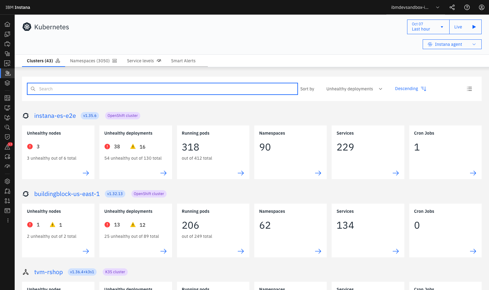
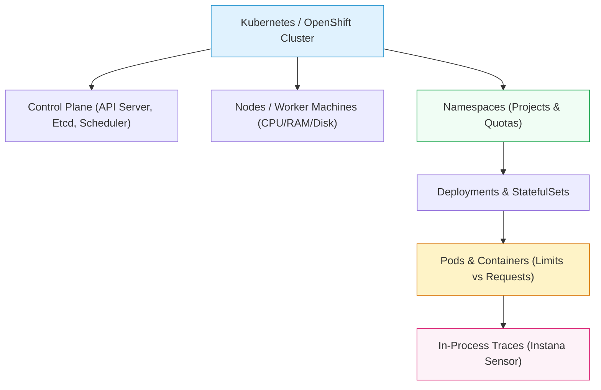
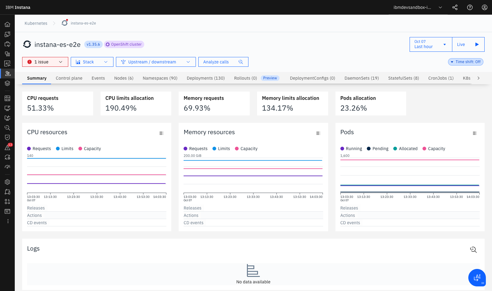

# **Lab 6 — Kubernetes & OpenShift Observability**

<span class="lab-badge">LAB 6</span><span class="lab-time">⏱ 15 minutes</span>

---

## **1. Cloud-Native Observability Challenges**

In container orchestration platforms like **Kubernetes** and **Red Hat OpenShift**, infrastructure is highly dynamic and volatile:

* **Dynamic Scheduling & Ephemeral Pods:** Pods are continuously created, terminated, scaled, or rescheduled across nodes in seconds.
* **Resource Overcommitment:** It is standard practice for CPU and memory `limits` to exceed physical node capacities (e.g., `CPU limits allocation > 190%`), causing silent performance degradation (*CPU Throttling*) or sudden pod kills (*OOMKilled*).
* **Disconnect between Orchestrator and Application Code:** Knowing that a `Deployment` has degraded replicas does not explain which HTTP request or database query triggered the failure.

**IBM Instana** bridges this gap by unifying **Control Plane and Kube-State** monitoring with automatic in-process transaction tracing inside every container.

---

## **2. Navigating the Platforms View (Kubernetes & OpenShift)**

1. In the left navigation menu, click **Platforms** and select **Kubernetes** (or **OpenShift**).
2. The global cluster monitoring dashboard will render:

<div class="screenshot-container">
  
  <div class="screenshot-caption">Figure 6.1: Kubernetes and OpenShift cluster overview (instana-es-e2e, amergeob2b, buildingblock-us-east-1) showing node health, degraded deployments, running pods, and namespaces.</div>
</div>

3. Review the summary cluster cards:

    * **Version & Type:** Cluster identifier and distribution (e.g., `instana-es-e2e v1.35.6 OpenShift cluster`).
    * **Unhealthy nodes:** Nodes experiencing resource pressure or `NotReady` states.
    * **Unhealthy deployments:** Deployments whose ready replicas deviate from desired spec counts.
    * **Running pods:** Real-time pod count versus cluster scheduling capacity.
    * **Namespaces & Services:** Discovered logical projects and network services.

---

## **3. Kubernetes Observability Hierarchy and Dimensions**

Instana models container orchestration through specialized perspective tabs:



1. **Summary:** Cluster resource allocation, requests vs. limits, and quota consumption.
2. **Control Plane:** Health of internal components (`kube-apiserver`, `etcd fsync latency`, `kube-controller-manager`).
3. **Events:** Real-time Kubernetes API event stream (`Scheduled`, `Pulled Image`, `BackOff`, `FailedScheduling`).
4. **Nodes:** Individual worker node health and hardware saturation.
5. **Namespaces:** Resource usage audited per team, project, or domain.
6. **Deployments, DaemonSets, StatefulSets, CronJobs:** Granular workload health inspection.

---

## **4. Resource Diagnostics: Requests, Limits, and CPU Throttling**

1. Click on one of the clusters in the list (e.g., `instana-es-e2e`):

<div class="screenshot-container">
  
  <div class="screenshot-caption">Figure 6.2: Detailed resource view for cluster instana-es-e2e showing CPU/Memory allocation KPIs against physical host capacity.</div>
</div>

2. **Resource Allocation KPIs Audit:**
    * **CPU requests (51.33%):** Guaranteed CPU reservation requested by pods relative to total physical capacity.
    * **CPU limits allocation (190.49%):** CPU overcommitment. The cluster allows pods to burst up to nearly double the physical CPU installed. During concurrent traffic spikes, the Linux CFS kernel scheduler enforces **CPU Throttling**, introducing severe latency delays.
    * **Memory requests (69.93%) & Memory limits (134.17%):** Memory headroom. If physical RAM is exhausted, the Linux *OOM Killer* immediately terminates non-compliant container processes.

---

## **5. From Kubernetes Orchestrator to Code Traces**

In the top header of the cluster dashboard, locate the **Analyze calls** button:

```text
┌────────────────────────────────────────────────────────┐
│  Kubernetes > instana-es-e2e                           │
│  [ Stack ▼ ]  [ Upstream / downstream ▼ ]  [ Analyze calls ⤹ ]
└────────────────────────────────────────────────────────┘
```

1. Click **Analyze calls**.
2. Instana automatically applies the contextual query filter:
   ```text
   kubernetes.cluster.name:instana-es-e2e
   ```
3. This seamlessly transports the engineer from cluster infrastructure topology directly into **Unbounded Analytics**, filtering all HTTP calls, SQL executions, and unhandled exceptions generated by workloads inside that cluster.

---

## **6. Lab 6 Summary and Checklist**

Upon completing this lab, you have gained the skills to:

* :white_check_mark: Navigate the complete *Kubernetes* and *OpenShift* hierarchy in Instana.
* :white_check_mark: Evaluate the operational health of clusters, worker nodes, namespaces, and workloads.
* :white_check_mark: Interpret resource allocation ratios (*Requests vs Limits*) to eliminate *CPU Throttling* and *OOMKilled* incidents.
* :white_check_mark: Correlate Kubernetes platform topology with distributed transaction traces in a single click.

---

[Continue to Lab 7: OpenTelemetry, SDK & Action Automation :octicons-arrow-right-24:](../lab7/index.md){ .md-button .md-button--primary }
