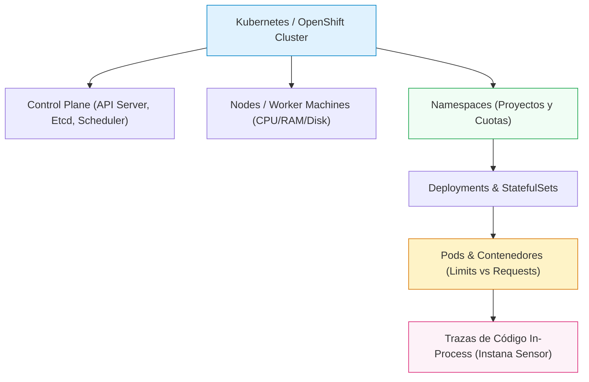

# **Lab 6 — Kubernetes & OpenShift Observability**

<span class="lab-badge">LAB 6</span><span class="lab-time">⏱ 15 minutos</span>

---

## **1. Los Desafíos de la Observabilidad Cloud-Native**

En plataformas de orquestación de contenedores como **Kubernetes** y **Red Hat OpenShift**, la infraestructura es altamente volátil:

* **Planificación Dinámica y Pods Efímeros:** Los pods se crean, destruyen, escalan o migran entre nodos en cuestión de segundos.
* **Sobreasignación de Recursos (Overcommitment):** Es común que los `limits` de CPU y memoria superen la capacidad física del clúster (ej. `CPU limits allocation > 190%`), lo que puede provocar contención silenciosa (*CPU Throttling*) o muertes repentinas de pods por falta de memoria (*OOMKilled*).
* **Desconexión entre Orquestador y Código de Aplicación:** Saber que un `Deployment` tiene réplicas en estado de degradación no explica qué petición HTTP o qué consulta a base de datos desencadenó el problema.

**IBM Instana** supera estas barreras integrando la monitorización del **Control Plane y Kube-State** con la instrumentación automática del código dentro de cada contenedor.

---

## **2. Navegación a la Vista de Plataformas (Kubernetes & OpenShift)**

1. En el menú de navegación lateral izquierdo, haz clic en **Platforms** y selecciona **Kubernetes** (o **OpenShift**).
2. Accederás al panel global de clústeres monitorizados:

<div class="screenshot-container">
  
  <div class="screenshot-caption">Figura 6.1: Catálogo de clústeres Kubernetes/OpenShift (instana-es-e2e, amergeob2b, buildingblock-us-east-1) con resumen de nodos, despliegues degradados, pods activos y namespaces.</div>
</div>

3. Observa las tarjetas resumen para cada clúster:

    * **Versión y Tipo:** Identificador de clúster y versión (ej. `instana-es-e2e v1.35.6 OpenShift cluster`).
    * **Unhealthy nodes:** Nodos con problemas de recursos o estado `NotReady`.
    * **Unhealthy deployments:** Despliegues cuyas réplicas activas no coinciden con las deseadas.
    * **Running pods:** Recuento en tiempo real de pods en ejecución frente a la capacidad total.
    * **Namespaces & Services:** Número total de espacios de nombres y servicios de red descubiertos.

---

## **3. Jerarquía y Dimensiones de Análisis en Kubernetes**

Instana modela la orquestación en múltiples pestañas especializadas:



1. **Summary:** Visión global de asignación de recursos y cuotas.
2. **Control Plane:** Monitorización de la salud interna de Kubernetes (`kube-apiserver`, `etcd fsync latency`, `kube-controller-manager`).
3. **Events:** Registro en tiempo real de eventos de la API de Kubernetes (`Scheduled`, `Pulled Image`, `BackOff`, `FailedScheduling`).
4. **Nodes (6):** Métricas individuales de cada máquina worker.
5. **Namespaces (90):** Auditoría de consumo por equipo o proyecto.
6. **Deployments (130), DaemonSets (19), StatefulSets (8), CronJobs (1):** Control granular por tipo de carga de trabajo.

---

## **4. Diagnóstico de Recursos: Requests, Limits y CPU Throttling**

1. Haz clic sobre uno de los clústeres de la lista (por ejemplo, `instana-es-e2e`):

<div class="screenshot-container">
  
  <div class="screenshot-caption">Figura 6.2: Panel detallado del cluster instana-es-e2e con KPIs de asignación de CPU/Memoria y desglose de recursos frente a capacidad física.</div>
</div>

2. **Auditoría de Asignación de Recursos (Resource Allocation KPIs):**
    * **CPU requests (51.33%):** Porcentaje de CPU reservada por los pods respecto a la capacidad total.
    * **CPU limits allocation (190.49%):** Sobrecompromiso de CPU. El clúster permite que los pods demanden hasta casi el doble de la CPU física instalada. Si todos los servicios tienen picos concurrentes, el kernel aplicará **CPU Throttling**, ralentizando las transacciones.
    * **Memory requests (69.93%) & Memory limits (134.17%):** Margen de memoria. Si el consumo real sobrepasa el 100% de la RAM del nodo, el kernel ejecutará el *OOM Killer*, terminando procesos inmediatamente.

---

## **5. De la Definición de Kubernetes a la Traza de Código**

En la cabecera superior del panel del clúster, localiza el botón **Analyze calls**:

```text
┌────────────────────────────────────────────────────────┐
│  Kubernetes > instana-es-e2e                           │
│  [ Stack ▼ ]  [ Upstream / downstream ▼ ]  [ Analyze calls ⤹ ]
└────────────────────────────────────────────────────────┘
```

1. Haz clic en **Analyze calls**.
2. Instana aplicará automáticamente el filtro:
   ```text
   kubernetes.cluster.name:instana-es-e2e
   ```
3. Esto traslada al ingeniero directamente desde la visión de infraestructura del clúster a la vista de **Unbounded Analytics**, mostrando todas las llamadas HTTP, sentencias SQL y excepciones generadas por las aplicaciones que corren dentro de ese clúster específico.

---

## **6. Resumen y Checklist del Lab 6**

Al finalizar este laboratorio, has adquirido las competencias para:

* :white_check_mark: Navegar por la jerarquía completa de *Kubernetes* y *OpenShift* en Instana.
* :white_check_mark: Evaluar el estado de salud de clústeres, nodos, namespaces y cargas de trabajo.
* :white_check_mark: Interpretar los índices de asignación de recursos (*CPU/Memory Requests vs Limits*) y prevenir problemas de *CPU Throttling* y *OOMKilled*.
* :white_check_mark: Correlacionar la topología de Kubernetes con las trazas de transacciones distribuidas en un solo clic.

---

[Continuar al Lab 7: OpenTelemetry, SDK & Action Automation :octicons-arrow-right-24:](../lab7/index.md){ .md-button .md-button--primary }
