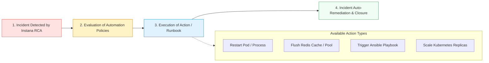

# **Lab 7 — OpenTelemetry, SDK & Action Automation**

<span class="lab-badge">LAB 7</span><span class="lab-time">⏱ 15 minutes</span>

---

## **1. Open Ecosystem: OpenTelemetry and Instana SDK**

Although Instana stands out for its automatic, zero-code instrumentation (*Zero-Code*), many organizations require standardizing on **OpenTelemetry (OTel)** or enriching their traces with custom business logic.

Instana provides first-class native support for the open standard:

* **Native OTLP Ingestion:** The Instana agent acts as a native OTel collector accepting traces and metrics via `gRPC (port 4317)` and `HTTP (port 4318)`.
* **W3C TraceContext:** Transparent header propagation (`traceparent`, `tracestate`) to seamlessly correlate services instrumented with OTel and services instrumented with Instana agents.
* **Instana SDK:** `@Span` annotations and programmatic libraries for Java, Node.js, Go, Python, and .NET.

---

## **2. Custom Instrumentation with Instana SDK (Java & Node.js)**

### Example 1: Java SDK with Annotations (@Span)
To trace a critical business method and record custom tags (such as customer ID or order amount):

```java
import com.instana.sdk.annotation.Span;
import com.instana.sdk.support.SpanSupport;

public class OrderProcessingService {

    @Span(type = Span.Type.INTERMEDIATE, value = "executeFraudCheck")
    public boolean checkFraudRisk(String customerId, double orderAmount) {
        // Enrich the span with business tags
        SpanSupport.annotate("business.customer_id", customerId);
        SpanSupport.annotate("business.order_amount", String.valueOf(orderAmount));
        
        if (orderAmount > 5000.0) {
            SpanSupport.annotate("business.risk_level", "HIGH");
            return false;
        }
        return true;
    }
}
```

### Example 2: Node.js Custom Span
```javascript
const instana = require('@instana/collector');

async function processPayment(paymentPayload) {
  return instana.sdk.callback.startIntermediateSpan('custom-payment-engine', (span) => {
    span.annotate('payment.method', paymentPayload.method);
    span.annotate('payment.currency', 'EUR');
    
    // Execution logic
    const result = performTransaction(paymentPayload);
    span.end();
    return result;
  });
}
```

---

## **3. Action Framework and Self-Healing Automation**

Instana's **Action Framework** closes the observability loop, shifting from *Detection* to **Automated Remediation**:

<div class="screenshot-container">
  
  <div class="screenshot-caption">Figure 7.1: Catalog of automated remediation actions and runbooks in Instana.</div>
</div>



### Common Use Cases for the Action Framework:

1. **Ansible Playbook Execution:** Trigger a Red Hat Ansible Automation Platform playbook when disk saturation or service failure is detected.
2. **CrashLooping Pod Remediation:** Execute sanitization scripts or capture *heap dumps* before a pod gets recycled.
3. **Predictive Scaling:** Adjust replica count in anticipation of high-concurrency traffic events.

---

## **4. Comprehensive Audit and Advanced Diagnostics**

By combining **Auto-Discovery, 100% Tracing, Dynamic Graph, Kubernetes Observability, OpenTelemetry, and Action Automation**, IBM Instana provides a unified platform for developers, SREs, and IT leaders:

```
Full-Stack Observability = 1s Telemetry + 100% Tracing + Live Topology + AI-Powered RCA + Automated Remediation
```

---

## **5. Summary and Lab 7 Checklist**

Upon completing this final lab, you have gained the skills to:

* :white_check_mark: Ingest *OpenTelemetry (OTLP)* telemetry with native Instana agents.
* :white_check_mark: Use the *Instana SDK* to inject custom spans and business tags.
* :white_check_mark: Understand how the *Action Framework* automates runbooks and remediation.
* :white_check_mark: Design an end-to-end modern observability and SRE architecture.

---

## **🎓 Workshop Conclusion and Certification Resources**

Congratulations on completing all 8 labs of the **IBM Instana Observability Workshop**!

* :octicons-book-24: [Official IBM Instana Documentation](https://www.ibm.com/docs/en/instana-observability)
* :octicons-mortar-board-24: [IBM Professional Certification Program](https://www.ibm.com/training/certification)
* :octicons-mark-github-24: [Workshop GitHub Repository](https://github.com/IBM-Automation-SPGI/instana-workshop)
