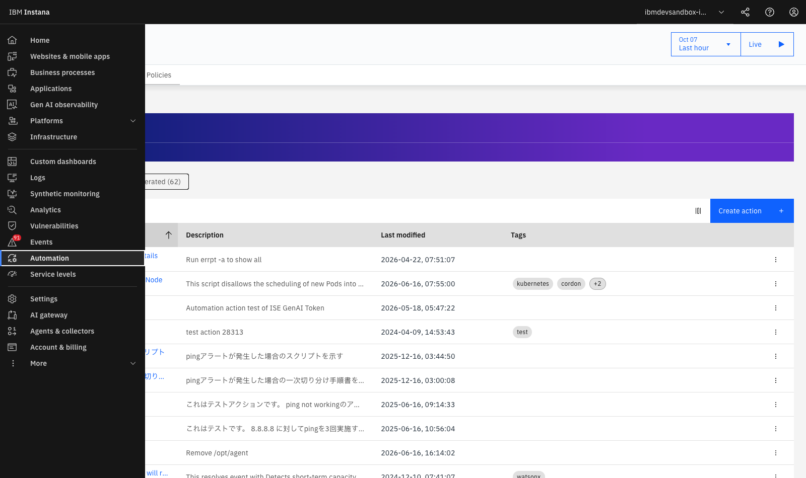
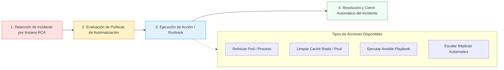

# **Lab 7 — OpenTelemetry, SDK & Action Automation**

<span class="lab-badge">LAB 7</span><span class="lab-time">⏱ 15 minutos</span>

---

## **1. Ecosistema Abierto: OpenTelemetry y SDK de Instana**

Aunque Instana destaca por su instrumentación automática sin código (*Zero-Code*), muchas organizaciones requieren estandarizar con **OpenTelemetry (OTel)** o enriquecer sus trazas con lógica de negocio personalizada.

Instana ofrece soporte nativo de primera clase para el estándar abierto:

* **Ingesta Nativa OTLP:** El agente de Instana actúa como un colector OTel nativo que acepta trazas y métricas vía `gRPC (puerto 4317)` y `HTTP (puerto 4318)`.
* **W3C TraceContext:** Propagación transparente de cabeceras (`traceparent`, `tracestate`) para correlacionar servicios instrumentados con OTel y servicios instrumentados con agentes de Instana.
* **Instana SDK:** Anotaciones `@Span` y librerías programáticas para Java, Node.js, Go, Python y .NET.

---

## **2. Instrumentación Personalizada con Instana SDK (Java & Node.js)**

### Ejemplo 1: Java SDK con Anotaciones (@Span)
Para trazar un método de negocio crítico y registrar etiquetas personalizadas (como el ID del cliente o el importe de la orden):

```java
import com.instana.sdk.annotation.Span;
import com.instana.sdk.support.SpanSupport;

public class OrderProcessingService {

    @Span(type = Span.Type.INTERMEDIATE, value = "executeFraudCheck")
    public boolean checkFraudRisk(String customerId, double orderAmount) {
        // Enriquecer el span con tags de negocio
        SpanSupport.annotate("business.customer_id", customerId);
        SpanSupport.annotate("business.order_amount", String.valueOf(orderAmount));
        
        if (orderAmount > 5000.0) {
            SpanSupport.annotate("business.risk_level", "HIGH");
            return false;
        }
        return true;
    }
}
```

### Ejemplo 2: Node.js Custom Span
```javascript
const instana = require('@instana/collector');

async function processPayment(paymentPayload) {
  return instana.sdk.callback.startIntermediateSpan('custom-payment-engine', (span) => {
    span.annotate('payment.method', paymentPayload.method);
    span.annotate('payment.currency', 'EUR');
    
    // Ejecución de la lógica
    const result = performTransaction(paymentPayload);
    span.end();
    return result;
  });
}
```

---

## **3. El Action Framework y Autorreparación (Self-Healing)**

El **Action Framework** de Instana permite cerrar el ciclo de la observabilidad pasando de la *Detección* a la **Remediación Automatizada**:

<div class="screenshot-container">
  
  <div class="screenshot-caption">Figura 7.1: Catálogo de acciones y runbooks de remediación automatizada en Instana.</div>
</div>



### Casos de Uso Habituales del Action Framework:

1. **Ejecución de Ansible Playbooks:** Desencadenar un playbook de Red Hat Ansible Automation Platform cuando se detecta saturación de disco o fallo de servicio.
2. **Reinicio de Pods en CrashLoop:** Ejecutar scripts de saneamiento o recolección de *heap dumps* antes de que el pod sea reciclado.
3. **Escalado Predictivo:** Ajustar el número de réplicas en previsión de un evento de alta concurrencia.

---

## **4. Auditoría Integral y Diagnóstico Avanzado**

Al combinar **Auto-Discovery, Tracing al 100%, Dynamic Graph, Kubernetes Observability, OpenTelemetry y Action Automation**, IBM Instana proporciona una plataforma unificada para desarrolladores, SREs y líderes de TI:

```
Observabilidad Completa = Telemetría 1s + 100% Tracing + Topología Viva + RCA con IA + Acción Automatizada
```

---

## **5. Resumen y Checklist del Lab 7**

Al finalizar este laboratorio final, has adquirido las competencias para:

* :white_check_mark: Integrar telemetría de *OpenTelemetry (OTLP)* con agentes de Instana.
* :white_check_mark: Utilizar el *Instana SDK* para inyectar spans personalizados y etiquetas de negocio.
* :white_check_mark: Comprender el funcionamiento del *Action Framework* para automatizar runbooks y remediación.
* :white_check_mark: Diseñar una estrategia de observabilidad y SRE moderna de extremo a extremo.

---

## **🎓 Conclusión del Workshop y Recursos de Certificación**

¡Enhorabuena por completar los 8 laboratorios del **Workshop de Observabilidad con IBM Instana**!

* :octicons-book-24: [Documentación Oficial de IBM Instana](https://www.ibm.com/docs/en/instana-observability)
* :octicons-mortar-board-24: [IBM Professional Certification Program](https://www.ibm.com/training/certification)
* :octicons-mark-github-24: [Repositorio del Workshop en GitHub](https://github.com/IBM-Automation-SPGI/instana-workshop)
